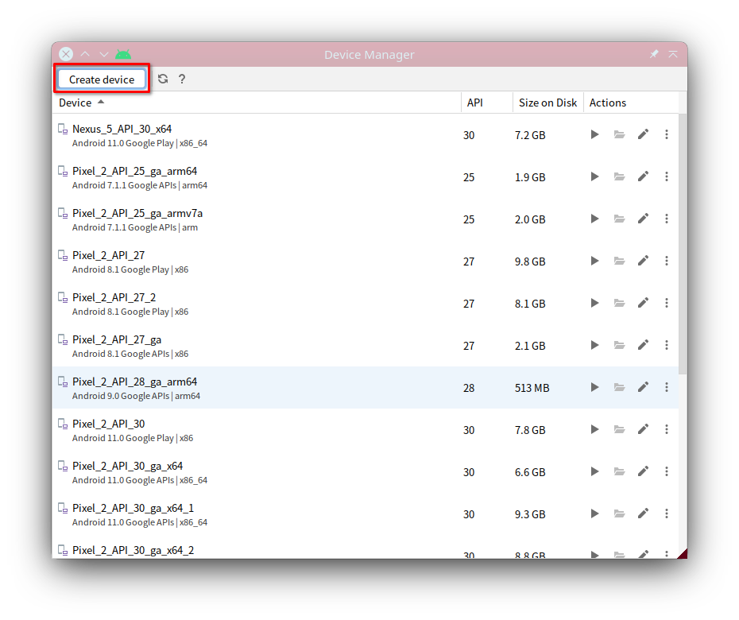

<!-- vimc: call SyntaxRange#Include('```sh', '```', 'sh', 'NonText'): -->
<!-- vimc: call SyntaxRange#Include('```ini', '```', 'dosini', 'NonText'): -->

## Evaluating and Training Agents on Mobile-Env

### Choose the Simulator Type

Mobile-Env now supports two types of Android simulators: local simulator and
remote simulator. If a local simulator is used, the simulator should be on the
same host machine with Mobile-Env environment interface. If a remote simulator
is used, the simulator can be launched alone on a remote machine and be
accessed remotely through Mobile-Env. Mobile-Env provides consistent interfaces
for both local and remote simulators and the internal implementation is
completely transparent to the agent. You won't need to further modify your
agent to switch the simulator type. Considering to launch an Android emulator
requires hardware-based acceleration like KVM (Kernel-Based Virtual Machine),
which is usually invalid on GPU clusters, the remote simulator will be helpful.

Once the simulator type is chosen, you can follow the guidelines below to
configure Android Emulator and create Android Virtual Device.

### Create an Android Virtual Device

An Android Virtual Device (AVD) running on [Android
Emulator](https://developer.android.com/about) is required to run Mobile-Env.
The AVD can be created through both [Android
Studio](https://developer.android.com/studio) and [Android Commandline
Tools](https://developer.android.com/studio).

##### Create an AVD through Android Studio

Launch the Android Studio after downloading and installing. You will first need
to install the Standard Development Kit (SDK). Open the SDK Manager and enter
Appearance & Behavior > System Settings > Android SDK sequentially. Here you
can check the installation path of the ADK (Android SDK Location). It is
commonly `~/Android/Sdk`. The desired version can be selected in the list
below. It is recommended to install Android 11 (API Level 30), as it is
observed in the test that, on the `amd64` host devices, Android 11 emulator and
image offer the best support for the `arm` packages.


Then it is the turn to create an AVD. Open the AVD Manager (or Virtual Device
Manager) and click Create device.



Then choose an desired AVD hardware：


Subsequently, select a version for the system image. For the same reason,
Android 11 (API Level 30) is recommended. Meanwhile, please choose the version
of Google APIs, but not that of Google Play. This is due to the root privillige
cannot be seized on Google Play images, which is required to solve the problem
of certificate pinning for Internet-based apps.


Finally, you can name your AVD and make several other configs.


The created AVD can be checked in the AVD list. The AVD folder can also be
opened in the file manager. It is always `~/.android/avd`.

More options are referred to in the
[document](https://developer.android.com/studio/run/managing-avds) offered by
Android Studio.

##### Create an AVD through the Commandline Tools

If the Android Studio is undesired, or a headless server is in use, the
Commandline Tools can be adopted to create an AVD.

Download and unzip the Android Commandline Tools.

```sh
export ANDROID_HOME="$HOME/Android/Sdk"
unzip commandlinetools-linux-8512546_latest.zip -d $ANDROID_HOME
```

Then install the emulator, image, and the platform tools by
[`sdkmanager`](https://developer.android.com/studio/command-line/sdkmanager).

```sh
$ANDROID_HOME/cmdline-tools/bin/sdkmanager --sdk_root=$android_home "emulator" "platform-tools" "platforms;android-30" "system-images;android-30;google_apis;x86_64"
```

Then use
[`avdmanager`](https://developer.android.com/studio/command-line/avdmanager) to
create an AVD.

```sh
AVD_NAME="Pixel_2_Test"
avdmanager create avd -n $AVD_NAME -c 8G -k "system-images;android-30;google_apis;x86_64" -d pixel_2
```

It is worth noting that there may be a config line in the `avdmanager`-created
AVD. You may need to change the line

```ini
image.sysdir.1 = Sdk/
```

in `~/.android/avd/$AVD_NAME.avd/config.ini` to

```ini
image.sysdir.1 = 
```

Or you can modify the file directly using the following command.

```sh
sed -i.bak -e 's#^\(image\.sysdir\.1[[:space:]]*=[[:space:]]*\)Sdk/#\1#g' ~/.android/avd/$AVD_NAME.avd/config.ini
```

### Solution of Certificate Pinning of Internet-Based Apps

Lots of information apps rely on the varying contents from the Internet. The
Internet contents vary according to the user's spatiotemporal position, which
will make the evaluation and training of agents inconsistent and the results
will be uncomparable. Commonly, we can crawl and store the necessary online
contents of the app and replay the stored contents during evaluation and
training through an MitM (Man-in-the-Middle) proxy. However, most apps tranfer
their data through HTTPS, thus, the MitM proxy can intercept the flow and
replay the contents correctly only if the app trusts its SSL certificate.
However, many apps adopt a policy named certificate pinning, so that the
certificates added into the "User Certificate" list in the operating system
(OS) will not be trusted. Three solutions are tested for this problem and quick
config scripts are provided. The details are referred to in [Certificate
Pinning Problem & Solutions](docs/dynamic-app-en.md).

### Launch the Interaction Environment

#### Launch an Interaction Environment with Local Simulator

```python
import android_env
from android_env.components.tools.easyocr_wrapper import EasyOCRWrapper
from android_env.components.coordinator import EventCheckControl

env = android_env.load( task_path
                      , avd_name
                      , android_avd_home="~/.android/avd"
                      , android_sdk_root="~/Android/Sdk"
                      , emulator_path="~/Android/Sdk/emulator/emulator"
                      , adb_path="~/Android/Sdk/platform-tools/adb"
                      , run_headless=True
                      , mitm_config=None
                      , start_token_mark=""
                      , non_start_token_mark="##"
                      , special_token_pattern: str = r"\[\w+\]"
                      , unify_vocabulary="vocab.txt"
                      , text_model=EasyOCRWrapper()
                      , icon_model=ResNet()
                      , with_view_hierarchy=False
                      , coordinator_args={ "vh_check_control_method": EventCheckControl.LIFT
                                         , "vh_check_control_value": 3.
                                         , "screen_check_control_method": EventCheckControl.LIFT
                                         , "screen_check_control_value": 1.
                                         }
                      )
```

The parameters are

* `task_path` - `str`. The path to the `textproto` task definition file. A
  folder is acceptable, in which case multiple `textproto` files can be loaded
  once to switch between them at runtime. If multiple tasks are being loaded,
  the tasks will be sorted as string according to their file name.
* `avd_name` - `str`. The name of the AVD.
* `android_avd_home`, `android_sdk_root`, `emulator_path`, `adb_path` - `str`. The
  path to several Android tools. The arguments in the example are the default
  values.
* `run_headless` - If the emulator should be launched headlessly. `True` is for
  headless, which means no graphical window will be created. `False` indicates
  that a graphical window will be available. `False` is the default.
* `mitm_config` - The config for the MitM proxy. If an MitM proxy is required
  for flow replaying, this parameter should be provided with a dict argument,
  in which there are three common fields:
  - `address` - The address the MitM proxy listens to, defaults to `127.0.0.1`.
  - `port` - The port the MitM proxy listens to, defaults to `8080`.
  - `method` - The solution of certificate pinning. Three solutions are
    supported.
    - `syscert` - Mocking a system certificate with the proxy's certificate
    - `frida` - Replacing the certificate verifier of the app at runtime by the
      instrument tool [Frida](https://github.com/frida/frida).
    - `packpatch` - Modifying the config inside the app package to unpin its
      certificate
    The details are presented in [Certificate Pinning Problem &
    Solutions](docs/dynamic-app-en.md). If `frida` solution is adopted, then
    three extra parameters can be set in the dict:
    - `frida-server` - The path to the frida server on the Android system,
      defaults to `/data/local/tmp/frida-server`.
    - `frida` - The path to the frida client on the host system, defaults to
      `frida`
    - `frida-script` - The path to the frida script on the host system which is
      used to replace the app's certificate verifier, defaults to `frida-script.js`
    `packpatch` will enable an extra parameter as well:
    - `patch-suffix` - This parameter defines a suffix `$suffix`. If the
      package file name defined in the task definition file is `$package.apk`,
      then the platform will seek `$package-$suffix.apk` for the patched
      package file. The prameter defaults to `patched`.
* `start_token_mark` - `str`. The prefix of the beginning tokens in the
  vocabulary. The typed beginning tokens will be separated with the preceding
  texts by a white space. This parameter defaults to the empty string `""`.
* `non_start_token_mark` - `str`. The prefix of the non-beginning tokens in the
  vocabulary. The typed non-beginning tokens are prepended to the existing
  texts directly. This parameter defaults to the prefix of BERT-style
  vocabularies `##`.
* `special_token_pattern` - `str`. The regex pattern of the special tokens in
  the vocabulary, defauts to `r"\[\w+\]"`, which matches the special tokens in
  BERT-style vocabularies like `[CLS]`.
* `unify_vocabulary` - `Optional[str]`. If a file name is specified, then it
  will be regarded as the vocabulary file, in which each line constitutes a
  token. This file will be loaded as the unified vocabulary for all the loaded
  tasks. If the parameter is unspecified, the small vocabulary defined in the
  task definition file will be adopted, in which case the small vocabulary for
  the different tasks may be different. This parameter defauts to `None`, which
  means "unspecified".
* `text_model` - Text model to enable recognizing the episode signals (*i.e.*,
  step instruction, reward, and the episode end) from the screen texts. No
  valid models will be loaded with the default argument.
* `icon_model` - Icon model to enable recognizing the episode signals (*i.e.*,
  step instruction, reward, and the episode end) from the screen icons. No
  valid models will be loaded with the default argument.
* `with_view_hierarchy` - If the view hierarchy (VH) should be returned in the
  observation. This option is disabled defaultly for the long latency of VH
  acquisition through ADB.
* `coordinator_args` - Used to cover the default arguments to create a
  `Coordinator`. It can be used to customize the arguments controlling the
  check to VH and screenshot. The parameters are:
  * `vh_check_control_method` & `vh_check_control_value`
  * `screen_check_control_method` & `screen_check_control_value`
  Here the `_method` parameters expect a `EventCheckControl` enum flag
  (`enum.Flag`). The valid values are `LIFT`, `TEXT`, `TIME`, and `STEP`.
  `LIFT` specifies to check "after `LIFT` action". `TEXT` specifies to check
  "after `TEXT` action". `TIME` indicates to check `in a certain time`. `STEP`
  indicates to check `in a certain step`. These control methods can be applied
  combined, while `STEP` will not task effect if `TIME` is specified, too.
  The `_value` parameters are used to specify the seconds to wait for `TIME` or
  the steps to wait for `STEP`.

The text model is supposed to implement two interfaces:

<!-- Text Interface Declaration {{{ -->
<details>
    <summary>Expand to view the interface details.</summary>

```python
def text_detector( screen: torch.Tensor
                 , bboxes: List[torch.Tensor]
                 ) -> List[List[str]]:
    """
    Args:
        screen (torch.Tensor): tensor of float32 with shape (3, height, width)
        bboxes (List[torch.Tensor]): list with length nb_bboxes of torch.Tensor
          of float32 with shape (1, 4) as the list of bboxes from which texts
          will be detected

    Returns:
        List[List[str]]: list with length nb_bboxes of list of str as the
          detection results for each bbox
    """

    return [[] for _ in bboxes]

def text_recognizer( screen: torch.Tensor
                   , bboxes: List[torch.Tensor]
                   ) -> List[str]:
    """
    Args:
        screen (torch.Tensor): tensor of float32 with shape (3, height, width)
        bboxes (List[torch.Tensor]): list with length nb_bboxes of torch.Tensor
          of float32 with shape (1, 4) as the list of bboxes from which texts
          will be recognized

    Returns:
        List[str]: list with length nb_bboxes of str as the recognition results
          of each bbox
    """

    return ["" for _ in bboxes]
```
</details>
<!-- }}} Text Interface Declaration -->

All the bounding boxes (bbox) are supposed to be given in the form of `[x0, y0, x1,
y1]`. The icon model is supposed to implement three interfaces:

<!-- Icon Interface Declaration {{{ -->
<details>
    <summary>Expand to view the interface details.</summary>

```python
def icon_detector( screen: torch.Tensor
                 , bboxes: List[torch.Tensor]
                 ) -> Tuple[ torch.Tensor
                           , List[List[str]]
                           ]:
    """
    Args:
        screen (torch.Tensor): tensor of float32 with shape (3, height, width)
        bboxes (List[torch.Tensor]): list with length nb_bboxes of torch.Tensor
          of float32 with shape (1, 4) as the list of bboxes from which icons
          will be detected

    Returns:
        torch.Tensor: tensor of float with shape (nb_bboxes, nb_candidates, 4)
        List[List[str]]: list with length nb_bboxes of list with length
          nb_candidates of str as the icon classes
    """

    return torch.stack(bboxes)\
         , [[""] for _ in bboxes]

def icon_recognizer( screen: torch.Tensor
                   , bboxes: List[torch.Tensor]
                    ) -> List[str]:
    """
    Args:
        screen (torch.Tensor): tensor of float32 with shape (3, height, width)
        bboxes (List[torch.Tensor]): list with length nb_bboxes of torch.Tensor
          of float32 with shape (1, 4) as the list of bboxes from which icons
          will be recognized

    Returns:
        List[str]: list with length nb_bboxes of str as the icon classes
    """

    return ["" for _ in bboxes]

def icon_matcher( screen: torch.Tensor
                , targets: List[torch.Tensor]
                , bboxes: torch.Tensor
                ) -> List[List[bool]]:
    """
    Args:
        screen (torch.Tensor): tensor of float32 with shape (3, height, width)
        targets (List[torch.Tensor]): list with length nb_targets of
          torch.Tensor of float32 with shape (3, height', width') as the target
          icon to match
        bboxes (torch.Tensor): tensor of float32 with shape (nb_targets, nb_candidates, 4)
          as the candidates for each target, may be the output from
          `icon_detector`

    Returns:
        List[List[bool]]: list with length nb_targets of list with length
          nb_candidates of bool indicating if the candidate is matched with the
          corresponding target
    """

    return [[False for _ in bb] for bb in bboxes]
```
</details>
<!-- }}} Icon Interface Declaration -->

#### Launch an Interaction Environment with Remote Simulator

##### Launch Remote Simulator Daemon

To launch an environment with remote simulator, you need to first launch a
simulator daemon on the remote machine. The daemon program is implemented with
[Flask](https://flask.palletsprojects.com/en/2.3.x/) framework and you can
launch the daemon with:

```sh
flask --app android_env.components.simulators.remote.daemon run -h <a.b.c.d> -p <ppp>
```

The daemon process will read simulator configuration from
`android-envd.conf.yaml` under the current working path. The config parameters
are the same with those of the aforementioned `android_env.load` function. An
example of configuration is provided as `examples/android-envd.conf.yaml`.

Currently, HTTPS protocol is not supported. You can establish the connection
through a secure channel like SSH.

##### Launch Interaction Environment to Connect to Remote Simulator

Then you can launch an environment with the remote simulator daemon through the
function below:

```python
import android_env
from android_env.components.tools.easyocr_wrapper import EasyOCRWrapper
from android_env.components.coordinator import EventCheckControl

env = android_env.load_remote( task_path
                             , address
                             , port
                             , timeout=5. # in seconds
                             , launch_timeout=2. # in minutes
                             , retry=3
                             , mitm_config=None
                             , start_token_mark=""
                             , non_start_token_mark="##"
                             , special_token_pattern: str = r"\[\w+\]"
                             , unify_vocabulary="vocab.txt"
                             , text_model=EasyOCRWrapper()
                             , icon_model=ResNet()
                             , with_view_hierarchy=False
                             , coordinator_args={ "vh_check_control_method": EventCheckControl.LIFT
                                                , "vh_check_control_value": 3.
                                                , "screen_check_control_method": EventCheckControl.LIFT
                                                , "screen_check_control_value": 1.
                                                }
                             )
```

Several parameters:

* `address` specifies the IP address the remote simulator daemon listens to. A
  string is expected.
* `port` specifies the port the remote daemon listens to. An interger is
  expected.
* `timeout` specifies the timeout for common revocation in seconds.
* `launch_timeout` specifies the timeout for launch revocation in minutes. This
  parameter is specified individually for the launch of a simulator instance
  takes much longer time.
* `retry` specifies the total number of attempts when timeouts or other network
  errors occur.

The other parameters are the same with those of the aforementioned
`android_env.load` function.

### Interact with the Environment

After loading the environment, you can create an agent to interact with the
environment.

```python
step: dm_env.TimeStep = env.switch_task(0) # switch to task 0
task_description: str = "\n".join(env.command()) # fetch the task description
instruction: str = "\n".join(env.task_instructions()) # fetch the current step instruction

reward: float = step.reward # record the current reward
while not step.last():
    # the agent makes decision
    action: Dict[str, np.ndarray] = agent(task_description, step.observation, instruction)
    # execute the action and obtain the new observation
    step = env.step(action)
    # update the step instruction
    if len(env.task_instructions())>0:
        instruction = "\n".join(env.task_instructions())
    reward += step.reward
```

`dm_env.TimeStep` is defined in [dm_env](https://github.com/deepmind/dm_env).
Commonly, there are 2 properties you will always access:

1. `reward`, a floating number, records the current reward.
2. `observation`, records the current observation.

In addition, `dm_env.TimeStep` is equipped with three methods returning a
boolean: `first`, `mid`, and `last`. These methods tell what state of the
episode the agent is in. `first` means that this is the first step after
resetting the environment, while `last` indicates that this is the last step of
the current episode (*i.e.*, the episode end).

`observation` is a `dict` object containing four items:

+ `pixels` - The shape is `(H, W, 3)` (height, width, channels). The data type
  (dtype) is `np.uint8` (8-bit unsigned integer). This item stores the RGB
  representation of the screen.
+ `timedelta` - An scalar array of a 64-bit float as the seconds after the last
  `step`.
+ `orientation` - A 4-dim one-hot vector with dtype as 8-bit unsigned interger.
  This item records the orientation of the screen. The positions of the "one"
  as 0, 1, 2, and 3 represent that the screen is rotated from the upright
  clockwise by 0, 90, 180, and 270 degrees respectively.
+ `view_hierarchy` - This item will be included if the `with_view_hierarchy`
  option is enabled while loading the environment. The value is an
  [`lxml.etree.Element`](https://lxml.de/apidoc/lxml.etree.html#lxml.etree._Element)
  object representing the VH of the current screen. The platform will request
  for the VH only at the initial step and `LIFT` steps owing to the long
  latency. In the other cases, this item will return `None`.

Here the first three items are returned as NumPy arrays.

`task_instructions` method returns a list of string storing the instructions at
the current step.

Mobile-Env accepts a `dict` object as the action containing four items:

+ `action_type` - A NumPy scalar array. The dtype is integer. It is
  corresponding to 4 action types:
  - 0 (`android_env.components.action_type.ActionType.TOUCH`) - The touch
    action.
  - 1 (`android_env.components.action_type.ActionType.LIFT`) - The (finger)
    lifting action.
  - 2 (`android_env.components.action_type.ActionType.REPEAT`) - "Repeat"
    action, *i.e.* doing nothing. This action will keep the previous touching
    or lifting status and inputing no tokens meanwhile.
  - 3 (`android_env.components.action_type.ActionType.TEXT`) - The token input
    action. This action will type a token from the vocabulary. If the
    `unify_vocabulary` parameter is specified during loading the environment,
    then the large vocabulary specified by this parameter is adopted. Otherwise
    the small vocabulary defined by the `vocabulary` field in the definition
    file of the current task will be used.
+ `touch_position` - A NumPy array with the dtype as floating number and length
  as 2. This argument represents the coordinates of the touch position `(x,
  y)`.  The coordinate values should be normalized to `[0, 1]`. This argument
  should be present for `TOUCH` and `LIFT` actions, but only has effect for
  `TOUCH` actions.
+ `input_token` - A NumPy scalar array. The dtype is integer. It is used to
  indicate the index of the token in the vocabulary. The index starts from 0.
  This argument is required only for the `TEXT` actions
+ `response` - A NumPy scalar array of Python `str` object. This field is
  designed for the responses from the agent to the human user.

`env.observation_spec` and `env.action_spec` can be invoked to obtain a
declaration of the observation space and the action space. Meanwhile, two
examples using a random policy and a human agent respectively are offered under
`examples` for reference.

In order to adapt to different types of agents, a suite of wrappers are
designed to alter the observation and action spaces. A few typical predefined
wrappers are listed below:

|         Wrapper         | Description                                                                |
|:-----------------------:|:---------------------------------------------------------------------------|
| `DiscreteActionWrapper` | Gridizes the screen to enable discrete agents.                             |
|  `ImageRescaleWrapper`  | Resizes the raw screen pixels.                                             |
|  `GymInterfaceWrapper`  | Provides [Gymnasium](https://gymnasium.farama.org/)-compatible interfaces. |
|      `VhIoWrapper`      | Provides VH-based interfaces for text-based agents.                        |

If new wrappers are expected to be defined, you can inherit
`android_env.wrappers.BaseWrapper` and implement the necessary hook methods
declared in it. There are four key hooks:

|         Hook        | Description                                                       |
|:-------------------:|:------------------------------------------------------------------|
|    `_reset_state`   | Invoked before resetting the environment or switching task goals. |
| `_post_switch_task` | Invoked after switching task goals.                               |
| `_process_timestep` | Alters `dm_env.TimeStep` before returning it to agent.            |
|  `_process_action`  | Alters the action before sending it to Android OS.                |

As regard more details about the wrappers and the usage, we refer you to
`android_env.wrappers` module.
