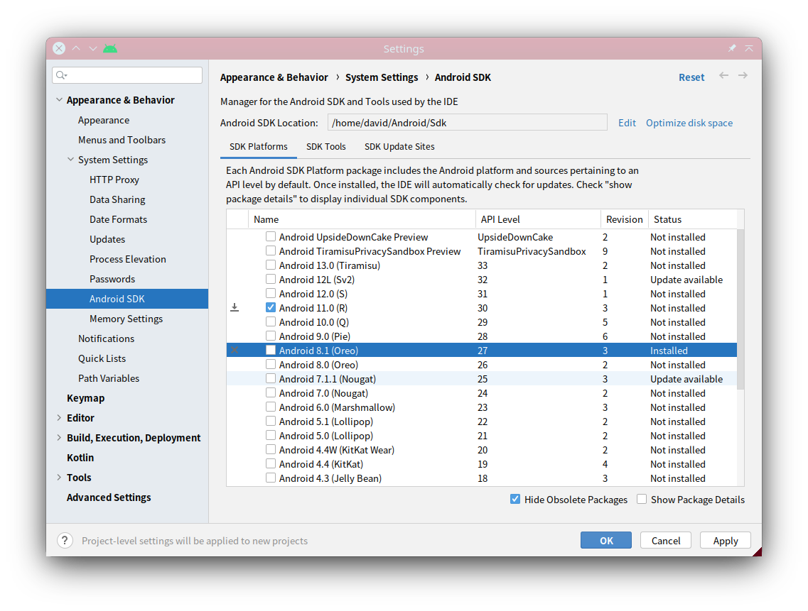
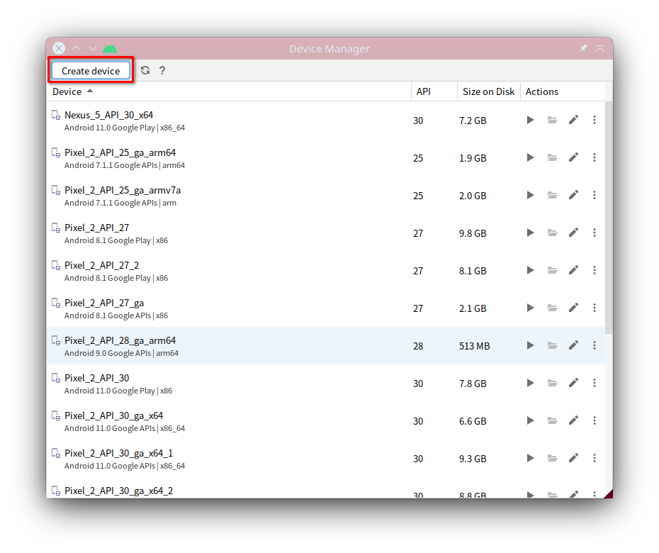
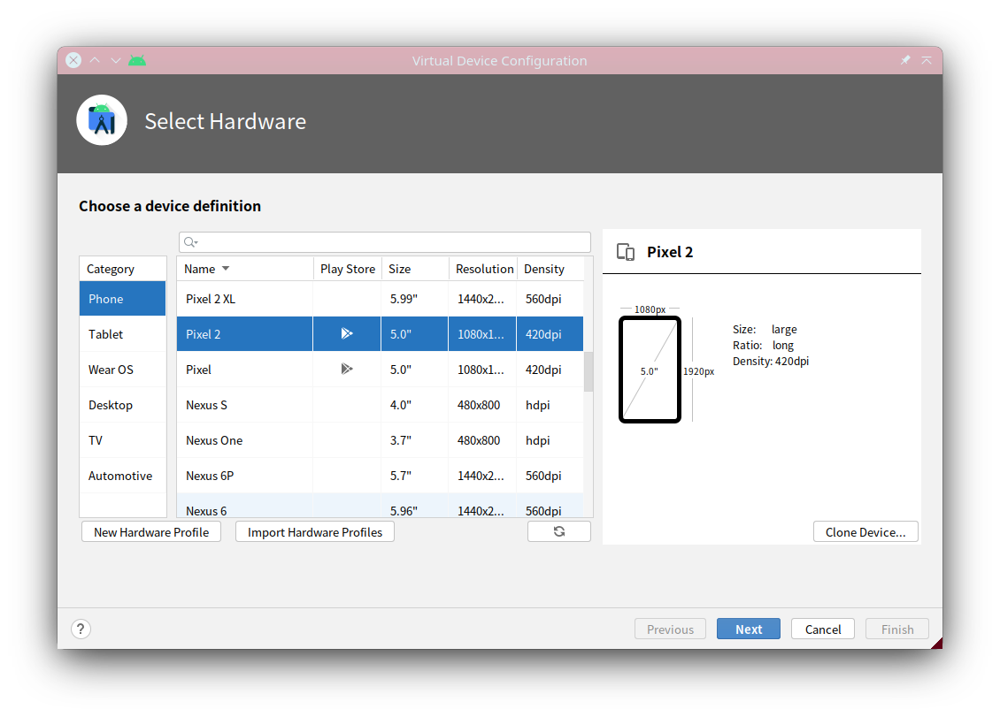
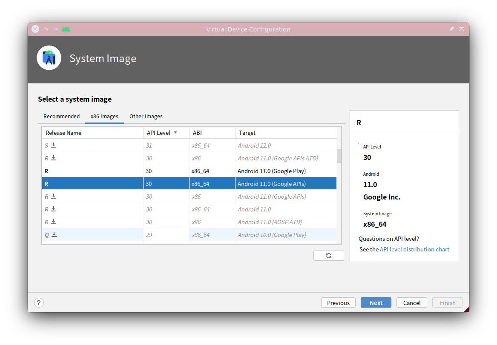
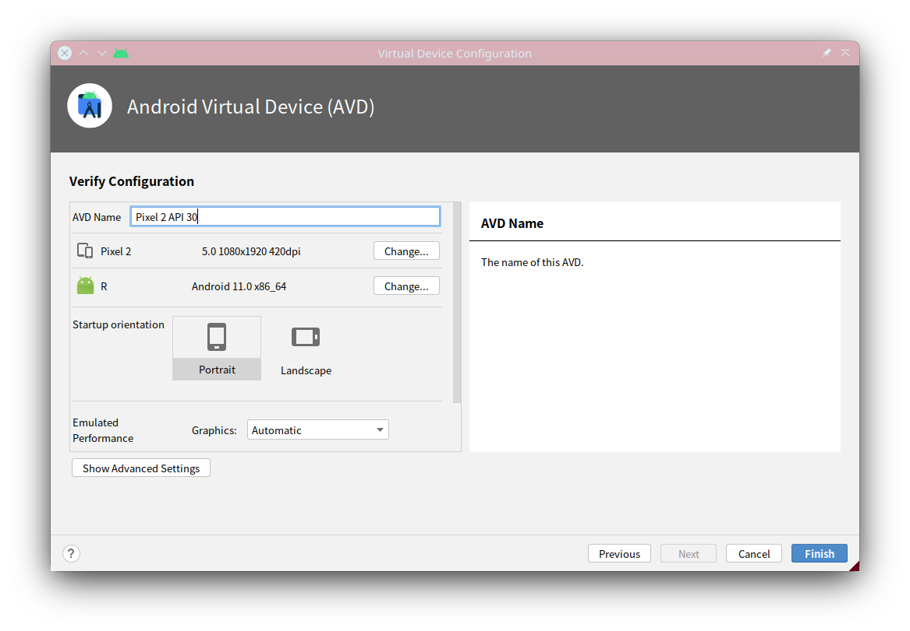

<!-- vim: set nospell iminsert=2: -->
<!-- vimc: call SyntaxRange#Include('```sh', '```', 'sh', 'NonText'): -->
<!-- vimc: call SyntaxRange#Include('```ini', '```', 'dosini', 'NonText'): -->

## 利用Mobile-Env验证、验证智能体

### 确定模拟器类型

Mobile-Env现支持两种类型的安卓模拟器：本地模拟器与远程模拟器。若使用本地模拟器，则Mobile-Env环境接口需与安卓模拟器位于同一台宿主机上；若采用远程模拟器，则可以将安卓模拟器单独放置在远程机器上，然后通过Mobile-Env远程访问之。无论采用本地模拟器还是远程模拟器，Mobile-Env都对外提供一致的接口，其内部实现对智能体程序完全透明，不需要对智能体做额外改动。考虑到采用模拟器运行安卓系统，需要宿主机启用诸如KVM（Kernel-Based Virtual Machine，内核虚拟机）的硬件加速，这在许多显卡集群上可能是不可用的，在这种情况下，远程模拟器会比较方便。

确定要采用的模拟器类型后，可参照后文，在需要运行模拟器的机器上配置安卓模拟器并创建虚拟机。

### 创建安卓虚拟机

使用Mobile-Env需要使用一台运行于[Android Emulator](https://developer.android.com/about)上的安卓虚拟机。虚拟机可以通过[Android Studio](https://developer.android.com/studio)创建，也可以通过[安卓命令行工具](https://developer.android.com/studio)创建。

##### 通过Android Studio创建安卓虚拟机

下载安装Android Studio后，启动之。首先要安装标准开发工具包（Standard Development Kit，SDK）。打开SDK Manager，依次进入Appearance & Behavior > System Settings > Android SDK，在这里可以检查工具包的安装位置（Android SDK Location），通常可能为`~/Android/Sdk`。从下面的列表中可以选择要安装的工具包版本。推荐安装Android 11 (API Level 30)版本，这是由于测试中发现，在`amd64`架构的宿主设备上，Android 11版本的模拟器和镜像对大量针对`arm`设备构建的软件包兼容能力最好。



接下来需要创建安卓虚拟设备（Android Virtual Device，AVD）。打开AVD Manager（或Virtual Device Manager），点击Create device。



接下来选择想要的机型：



然后选择系统镜像的版本。同样，镜像版本推荐采用Android 11 (API Level 30)。同时请选择Google APIs版本而非Google Play版本，这是由于，为解决联网应用的固定SSL证书的问题，需要获取虚拟机的root权限，而在Google Play版本上，root权限会获取失败。



最后可以给要创建的虚拟机起个名字，并配置些其他内容。



在虚拟机列表中可以查看已创建的虚拟机，也可以选择在文件管理器中打开虚拟机的目录。虚拟机通常存于`~/.android/avd`下。

更多的创建、配置选项可以参考Android Studio提供的[创建虚拟机的文档](https://developer.android.com/studio/run/managing-avds)。

##### 通过命令行工具创建安卓虚拟机

如果不需要Android Studio，或要使用没有图形界面的服务器，也可以采用命令行工具创建虚拟机。

下载安卓命令行工具的安装包后，将之解压：

```sh
export ANDROID_HOME="$HOME/Android/Sdk"
unzip commandlinetools-linux-8512546_latest.zip -d $ANDROID_HOME
```

然后运行[`sdkmanager`](https://developer.android.com/studio/command-line/sdkmanager)安装模拟器、镜像、相关工具。

```sh
$ANDROID_HOME/cmdline-tools/bin/sdkmanager --sdk_root=$android_home "emulator" "platform-tools" "platforms;android-30" "system-images;android-30;google_apis;x86_64"
```

之后需要利用[`avdmanager`](https://developer.android.com/studio/command-line/avdmanager)创建虚拟机。

```sh
AVD_NAME="Pixel_2_Test"
avdmanager create avd -n $AVD_NAME -c 8G -k "system-images;android-30;google_apis;x86_64" -d pixel_2
```

值得一提的是，`avdmanager`创建的虚拟机有时某项配置会存在问题，需要将`~/.android/avd/$AVD_NAME.avd/config.ini`中

```ini
image.sysdir.1 = Sdk/
```

一行改为

```ini
image.sysdir.1 = 
```

也可以直接通过

```sh
sed -i.bak -e 's#^\(image\.sysdir\.1[[:space:]]*=[[:space:]]*\)Sdk/#\1#g' ~/.android/avd/$AVD_NAME.avd/config.ini
```

命令修改。

### 解决部分联网应用固定SSL证书的问题

许多信息类应用依赖互联网获取变化的内容，这些内容取决于使用应用的时间和位置，这会导致测试、训练智能体的条件变得不一致，导致结果无法相互比较。要应对这个问题，可以爬取所需的应用在线内容，然后在测试、训练时通过中间人代理工具将保存的内容回放给应用程序。但大多应用都使用HTTPS传输数据，因此需要应用端信任中间人代理的SSL证书，才能截取通信流量并正确回放内容。然而很多应用采用了固定证书的策略，也就是说，在操作系统设置中加入”用户证书“列表的证书，该应用不会信任。针对该问题，测试了三种解决方案，并提供了快捷配置的脚本，具体步骤请参考[证书固定问题及解决方案](dynamic-app-zh.md)。

### 创建交互环境

#### 利用本地模拟器创建交互环境

```python
import android_env
from android_env.components.tools.easyocr_wrapper import EasyOCRWrapper
from android_env.components.coordinator import EventCheckControl

env = android_env.load( task_path
                      , avd_name
                      , android_avd_home="~/.android/avd"
                      , android_sdk_root="~/Android/Sdk"
                      , emulator_path="~/Android/Sdk/emulator/emulator"
                      , adb_path="~/Android/Sdk/platform-tools/adb"
                      , run_headless=True
                      , mitm_config=None
                      , start_token_mark=""
                      , non_start_token_mark="##"
                      , special_token_pattern: str = r"\[\w+\]"
                      , unify_vocabulary="vocab.txt"
                      , text_model=EasyOCRWrapper()
                      , icon_model=ResNet()
                      , with_view_hierarchy=False
                      , coordinator_args={ "vh_check_control_method": EventCheckControl.LIFT
                                         , "vh_check_control_value": 3.
                                         , "screen_check_control_method": EventCheckControl.LIFT
                                         , "screen_check_control_value": 1.
                                         }
                      )
```

其中各参数的意义：

* `task_path` - `str`，要使用的`textproto`任务定义文件的路径，或提供一个目录，目录下面可以包含多个`textproto`文件，以一次性加载多个任务，然后在运行中可以动态切换任务；加载多个任务时，各任务会根据文件名按字符串顺序排序。
* `avd_name` - `str`，要使用的虚拟机的名称。
* `android_avd_home`、`android_sdk_root`、`emulator_path`、`adb_path` - `str`，若干安卓工具的路径，示例中即为函数定义的默认参数。
* `run_headless` - 是否要在无图形窗口的情况下运行，`True`为无图像窗口，`False`为带图形窗口，默认为`False`。
* `mitm_config` - 指定中间人代理的配置。若需要中间人代理回放流量，则要提供一个词典参数，其中包含三个通用字段：
  - `address` - 指定中间人代理提供服务的地址，默认为`127.0.0.1`；
  - `port` - 指定中间人代理监听的端口，默认为`8080`；
  - `method` - 指定证书固定问题的解决方案，共支持三种方案
    - `syscert` - 伪装系统证书
    - `frida` - 采用注入工具[Frida](https://github.com/frida/frida)在运行时替换应用程序的证书验证器
    - `packpatch` - 修改软件包配置，以解除其固定证书
    具体内容请参考[证书固定问题及解决方案](dynamic-app-zh.md)；其中`frida`方案可以在词典中指定三个额外参数：
    - `frida-server` - 安卓系统上frida服务端程序的路径，默认为`/data/local/tmp/frida-server`
    - `frida` - 宿主系统上frida客户端程序的路径，默认为`frida`
    - `frida-script` - 宿主系统上用来替换手机应用的证书验证器的frida脚本的路径，默认为`frida-script.js`
    `packpatch`方案同样带有一个可配置的参数：
    - `patch-suffix` - 该参数定义一个后缀`$suffix`，若任务定义文件中指定的安装包文件名为`$package.apk`，则平台会认为修改过的软件包文件名为`$package-$suffix.apk`，并按之寻找；该参数默认值为`patched`
* `start_token_mark` - `str`，指定词表中起始词元（token）的前缀；起始词元输入时会通过空格与之前的文本隔开，默认为空串`""`。
* `non_start_token_mark` - `str`，指定词表中非起始词元的前缀；非起始词元输入时会直接接在之前的文本后面，默认为BERT系列词表的前缀`##`。
* `special_token_pattern` - `str`，正则表达式，指定词表中特殊词元的模式，默认为`r"\[\w+\]"`，识别BERT系列词表中`[CLS]`等特殊词元。
* `unify_vocabulary` - `Optional[str]`，若指定一个文件名，则会将之视为词表文件，每行为一个词元，读取该文件得到所有加载的任务统一的词表。若不指定，则会采用每个任务定义中的小词表，各任务的小词表可能不同；默认为`None`，即不指定。
* `text_model` - 指定文本模型用于识别屏幕文本以支持从中检测步骤指令、回报、历程结束等历程信号；默认值不挂载任何有效模型。
* `icon_model` - 指定图表模型用来识别屏幕图标以支持从中检测步骤指令、回报、历程结束等历程信号；默认值不挂载任何有效模型。
* `with_view_hierarchy` - 是否在返回的观测中加入视图框架（View Hierarchy）项；由于通过ADB获取视图框架时延较长，因此该选项默认不开启
* `coordinator_args` - 用于覆盖创建`Coordinator`时的默认参数，可用于传递管理对视图框架与屏幕图像的检查的参数。两组参数分别为
  * `vh_check_control_method`、`vh_check_control_value`
  * `screen_check_control_method`、`screen_check_control_value`
  其中`_method`参数需提供`EventCheckControl`枚举标识（`enum.Flag`），有效值为：`LIFT`、`TEXT`、`TIME`、`STEP`，分别表示“在`LIFT`动作后”“在`TEXT`动作后”“间隔一定时间后”“间隔一定步数后”进行检查，不同控制方法可以组合使用，但当`TIME`和`STEP`同时指定时，`STEP`方案不会生效；`_value`参数用于指定`TIME`方法等待的秒数或`STEP`方法等待的步数

传入的文本模型需要实现两个接口：

<!-- 文本接口声明 {{{ -->
<details>
    <summary>展开查看具体接口声明</summary>

```python
def text_detector( screen: torch.Tensor
                 , bboxes: List[torch.Tensor]
                 ) -> List[List[str]]:
    """
    Args:
        screen (torch.Tensor): tensor of float32 with shape (3, height, width)
        bboxes (List[torch.Tensor]): list with length nb_bboxes of torch.Tensor
          of float32 with shape (1, 4) as the list of bboxes from which texts
          will be detected

    Returns:
        List[List[str]]: list with length nb_bboxes of list of str as the
          detection results for each bbox
    """

    return [[] for _ in bboxes]

def text_recognizer( screen: torch.Tensor
                   , bboxes: List[torch.Tensor]
                   ) -> List[str]:
    """
    Args:
        screen (torch.Tensor): tensor of float32 with shape (3, height, width)
        bboxes (List[torch.Tensor]): list with length nb_bboxes of torch.Tensor
          of float32 with shape (1, 4) as the list of bboxes from which texts
          will be recognized

    Returns:
        List[str]: list with length nb_bboxes of str as the recognition results
          of each bbox
    """

    return ["" for _ in bboxes]
```
</details>
<!-- }}} 文本接口声明 -->

其中所有边界框均用`[x0, y0, x1, y1]`的方式表示；而图标模型则需要实现三个接口：

<!-- 图标接口声明 {{{ -->
<details>
    <summary>展开查看具体接口声明</summary>

```python
def icon_detector( screen: torch.Tensor
                 , bboxes: List[torch.Tensor]
                 ) -> Tuple[ torch.Tensor
                           , List[List[str]]
                           ]:
    """
    Args:
        screen (torch.Tensor): tensor of float32 with shape (3, height, width)
        bboxes (List[torch.Tensor]): list with length nb_bboxes of torch.Tensor
          of float32 with shape (1, 4) as the list of bboxes from which icons
          will be detected

    Returns:
        torch.Tensor: tensor of float with shape (nb_bboxes, nb_candidates, 4)
        List[List[str]]: list with length nb_bboxes of list with length
          nb_candidates of str as the icon classes
    """

    return torch.stack(bboxes)\
         , [[""] for _ in bboxes]

def icon_recognizer( screen: torch.Tensor
                   , bboxes: List[torch.Tensor]
                    ) -> List[str]:
    """
    Args:
        screen (torch.Tensor): tensor of float32 with shape (3, height, width)
        bboxes (List[torch.Tensor]): list with length nb_bboxes of torch.Tensor
          of float32 with shape (1, 4) as the list of bboxes from which icons
          will be recognized

    Returns:
        List[str]: list with length nb_bboxes of str as the icon classes
    """

    return ["" for _ in bboxes]

def icon_matcher( screen: torch.Tensor
                , targets: List[torch.Tensor]
                , bboxes: torch.Tensor
                ) -> List[List[bool]]:
    """
    Args:
        screen (torch.Tensor): tensor of float32 with shape (3, height, width)
        targets (List[torch.Tensor]): list with length nb_targets of
          torch.Tensor of float32 with shape (3, height', width') as the target
          icon to match
        bboxes (torch.Tensor): tensor of float32 with shape (nb_targets, nb_candidates, 4)
          as the candidates for each target, may be the output from
          `icon_detector`

    Returns:
        List[List[bool]]: list with length nb_targets of list with length
          nb_candidates of bool indicating if the candidate is matched with the
          corresponding target
    """

    return [[False for _ in bb] for bb in bboxes]
```
</details>
<!-- }}} 图标接口声明 -->

#### 利用远程模拟器创建交互环境

##### 启动远程模拟器服务

要使用远程模拟器来创建交互环境，首先需要在一台远程机器上启动远程模拟器服务。远程模拟器服务程序采用[Flask](https://flask.palletsprojects.com/en/2.3.x/)框架实现，可以用以下命令启动服务进程。

```sh
flask --app android_env.components.simulators.remote.daemon run -h <a.b.c.d> -p <ppp>
```

服务进程启动时，会从当前所在目录下的`android-envd.conf.yaml`中读取模拟器配置。配置参数同前述`android_env.load`函数中的模拟器参数相同。`examples/android-envd.conf.yaml`提供了一份配置范例。

当前没有实现HTTPS协议，作为替代，可以采用基于SSH等的安全信道建立通信。

##### 启动交互环境连接远程模拟器

使用以下函数启动一个交互环境连接远程模拟器。

```python
import android_env
from android_env.components.tools.easyocr_wrapper import EasyOCRWrapper
from android_env.components.coordinator import EventCheckControl

env = android_env.load_remote( task_path
                             , address
                             , port
                             , timeout=5. # 单位：秒
                             , launch_timeout=2. # 单位：分钟
                             , retry=3
                             , mitm_config=None
                             , start_token_mark=""
                             , non_start_token_mark="##"
                             , special_token_pattern: str = r"\[\w+\]"
                             , unify_vocabulary="vocab.txt"
                             , text_model=EasyOCRWrapper()
                             , icon_model=ResNet()
                             , with_view_hierarchy=False
                             , coordinator_args={ "vh_check_control_method": EventCheckControl.LIFT
                                                , "vh_check_control_value": 3.
                                                , "screen_check_control_method": EventCheckControl.LIFT
                                                , "screen_check_control_value": 1.
                                                }
                             )
```

其中

* `address`参数为远程模拟器服务监听的网络地址，需要传入一个字符串
* `port`参数为远程模拟器服务监听的端口，需要传入一个整数
* `timeout`参数指定调用一般远程命令的等待超时时间，以“秒”为单位
* `launch_timeout`参数指定调用启动命令时的等待超时时间；模拟器启动耗时较长，因此将该参数单独列出；该参数以“分钟”为单位
* `retry`参数指定超时或发成其他网络错误时，总的尝试次数

其余参数均与前述`android_env.load`函数的参数相同。

### 与环境交互

创建环境后，便可以利用智能体与之交互：

```python
step: dm_env.TimeStep = env.switch_task(0) # 切换到任务0
task_description: str = "\n".join(env.command()) # 获取任务描述
instruction: str = "\n".join(env.task_instructions()) # 获取单步指令

reward: float = step.reward # 记录当前回报
while not step.last():
    # 智能体决策
    action: Dict[str, np.ndarray] = agent(task_description, step.observation, instruction)
    # 执行动作并获取新观测
    step = env.step(action)
    # 更新步骤指令
    if len(env.task_instructions())>0:
        instruction = "\n".join(env.task_instructions())
    reward += step.reward
```

`dm_env.TimeStep`定义于[dm_env](https://github.com/deepmind/dm_env)，有2个重要属性：

1. `reward`，浮点数，记录回报值
2. `observation`，记录当前观测

此外还有三个返回逻辑值的方法：`first`、`mid`、`last`，可用来判断当前交互步处于交互历程中的什么位置。`first`意味着这是任务开始后的第一个步骤，`last`意味着该步骤是当前历程的最后一个步骤（即历程结束）。

`observation`为一个`dict`对象，包含四项，其中前三项均以NumPy数组形式返回：

+ `pixels` - 形状为`(H, W, 3)`（高、宽、通道数），元素类型为`np.uint8`（8位无符号整数），提供屏幕图像的RGB表示
+ `timedelta` - 64位浮点数标量数组，距上次`step`后经过的秒数
+ `orientation` - 四维单热向量，类型为8位无符号整数，表示屏幕的方向；“一”的位置0、1、2、3分别表示屏幕相对竖直位置顺时针旋转0、90、180、270度。
+ `view_hierarchy` - 若加载环境时启用了`with_view_hierarchy`选项，则会返回该项。为[`lxml.etree.Element`](https://lxml.de/apidoc/lxml.etree.html#lxml.etree._Element)对象，表示屏幕对应的视图框架。由于获取视图框架的时延较长，只会在初始步骤以及`LIFT`动作之后尝试获取之，其余情况下，该项的值为`None`

`task_instructions`方法返回字符串列表，存储当前步骤下的指令。

Mobile-Env的环境接受的动作的形式为`dict`对象，其包含四项：

+ `action_type` - 是NumPy标量数组，数据类型为整数，对应4种动作类型
  - 0（`android_env.components.action_type.ActionType.TOUCH`） - 触击动作
  - 1（`android_env.components.action_type.ActionType.LIFT`） - 抬起（手指）动作
  - 2（`android_env.components.action_type.ActionType.REPEAT`） - “重复”动作，即什么都不做，保持之前的触击或抬起状态，同时不输入任何词元
  - 3（`android_env.components.action_type.ActionType.TEXT`） - 输入词元动作，输入词表中的一个词元；若加载环境时指定了`unify_vocabulary`参数，则使用的是该参数指定的大词表，否则使用的是当前任务的定义文件中`vocabulary`字段提供的小词表
+ `touch_position` - NumPy数组，数据类型为浮点数，长度为2，表示触击的坐标`(x, y)`，坐标值归一化到`[0, 1]`；对`TOUCH`、`LIFT`动作都需要提供该参数，但仅对`TOUCH`参数有作用
+ `input_token` - NumPy标量数组，数据类型为整数，指定要输入的词元在词表中的序号，从0开始；仅需对`TEXT`动作指定
+ `response` - NumPy标量数组，存储Python`str`对象，为智能体给人类用户的回复内容

可以使用`env.observation_spec`、`env.action_spec`方法获取对观测空间与动作空间格式的声明。此外，在`examples`目录下提供了两个分别使用随机策略和由人类充当智能体的例子，以供参考。

为了适应观测、动作空间多样的智能体，本平台支持利用包装器修改观测和动作空间。一些预定义的典型包装器包括：

|          包装器         | 说明                                                     |
|:-----------------------:|:---------------------------------------------------------|
| `DiscreteActionWrapper` | 将屏幕网格化，从而能够使用离散动作的智能体               |
|  `ImageRescaleWrapper`  | 缩放屏幕尺寸                                             |
|  `GymInterfaceWrapper`  | 提供[Gymnasium](https://gymnasium.farama.org/)风格的接口 |
|      `VhIoWrapper`      | 为基于文本的智能体提供基于视图框架的交互接口             |

若要自行定义新的包装器，可以继承`android_env.wrappers.BaseWrapper`，根据需要实现其中声明的挂钩方法即可。主要的挂钩方法有四个：

|         挂钩        | 说明                                            |
|:-------------------:|:------------------------------------------------|
|    `_reset_state`   | 在重置环境，或切换任务目标前，会调用该方法      |
| `_post_switch_task` | 在切换任务目标后，会调用该方法                  |
| `_process_timestep` | 修改得到的`dm_env.TimeStep`，再将之返回给智能体 |
|  `_process_action`  | 修改智能体输入的动作对象，再送入环境            |

更多包装器及其用法，请参考`android_env.wrappers`模块。
