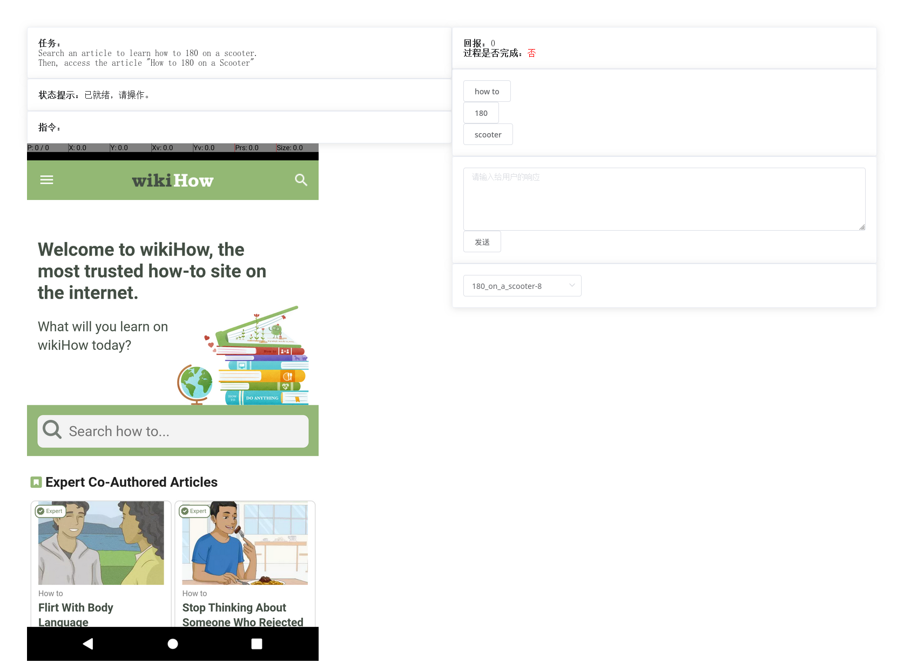
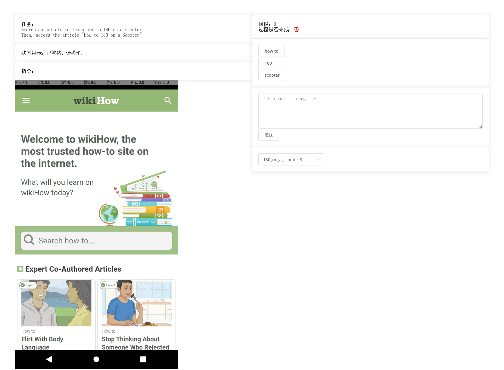
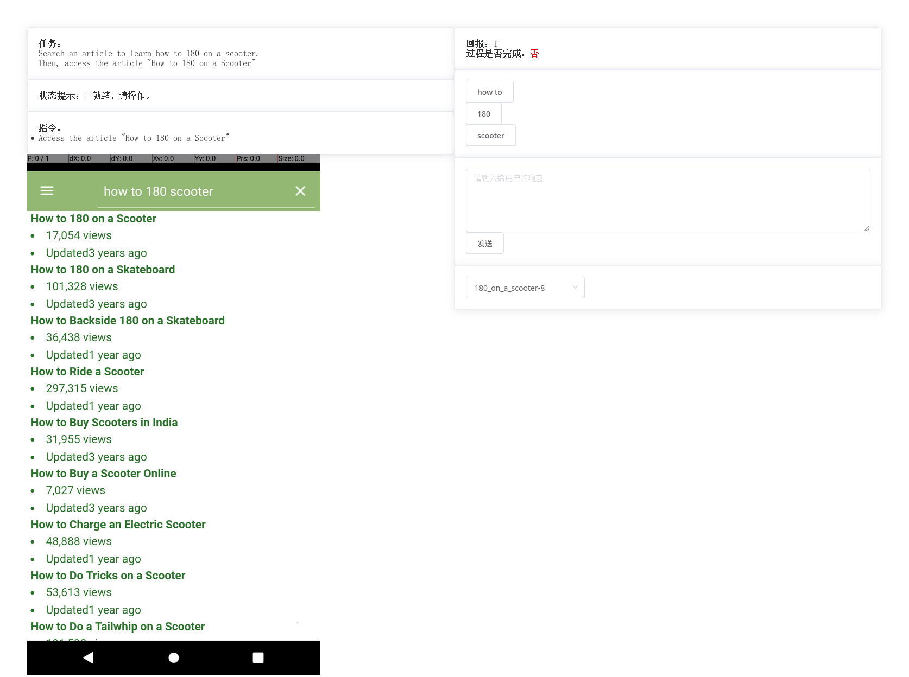

<!-- vimc: call SyntaxRange#Include('```sh', '```', 'sh', 'NonText'): -->
<!-- vimc: call SyntaxRange#Include('```ebnf', '```', 'ebnf', 'NonText'): -->

## Miscellaneous Auxiliary Tools

### Annotation Tool for Human Demonstration

An annotation tool based on web interface is developed to collect human
demonstrations for behavior cloning approaches. ~~A ready-to-use docker image
is provided for convenience at <https://hub.docker.com/r/zdy023/mobile-env-web>
(Deprecated)~~.  The usage of the annotation tool is demonstrated in our [demo
video](https://youtu.be/gKV6KZYwxGY).






Usage of the web interface of annotation tool is referred to in
[README.md](../tools/annotation-tool/README.md)

Exept for the web interface, a few command line tools are offered for
preprocessing and visualization of the annotations. The codes are stored at
`../tools/annotation-tool/pkl_tools`.

##### Annotation Resaving Tool

The annotations dumped directly by the web interface are saved in pickle files
trajectory by trajectory. The pickle files are named `annotator_name.%d.pkl`
where `%d` is the index of the trajectory. The resaving tool will assemble the
individual trajectories and resave them according to their task goals. It is
invoked as:

```sh
python resave_pickles.py PKL_NAME:S:T DUMPDIR TASKFOLDER
```

+ `PKL_NAME` - The pattern for the path to the trajectory files that should be
  resaved, *e.g.*, `web-dumps/zdy023.%d.pkl`.
+ `S`, `T` - The range of the trajectory indices (inclusive), which are used to
  replace the `%d` in the pattern.
+ `DUMPDIR` - The folder for the resaved annonation files.
+ `TASKFOLDER` - The folder for the task definition files.

The format of the resaved file is like:

```
{
    "meta": {
        "otask_id": str # The task id declared in the task definition file.
        "otask_name": str # The task name declared in the task definition file.
        "task_definition_id": str # The main file name of the task definition file.
    }
    "trajectories": [
        {
            "task_id": str # This field appears only in the first list element.
            "task": str # This field appears only in the first list element.
            "observation": np.ndarray # The shape is (width, height, 3). The dtype is float32. The content is the screen image in RGB.
            "view_hierarchy": Optional[str] # The view hierarchy in XML.
            "orientation": np.int64 # Record of the screen orientation.
            "action_type": np.int64 # 0, 1, 2, and 3 as TOUCH, LIFT, REPEAT, and TEXT respectively. This field does not appear in the first list element.
            "touch_position": np.ndarray # The shape is (2,). The type is float32. The values are normalized to [0, 1]. This field does not appear in the first list element and appears only in the steps with action type TOUCH.
            "input_token": str # This field does not appear in the first element and appears only in the steps with action type TEXT.
            “reward": float # This field does not appear in the first element and may not appear in the steps whose reward is 0.
            "instruction": List[str] # This field does not appear in the first element and appears only in the steps triggered the instruction event.
        },
        ...
    ]
}
```

##### Visualization Tool

The resaved annotations can be visualized to frames annotated with the action,
reward, instruction, *etc.* for convenient review.

```sh
python visualize_pickle.py PKL_NAME DUMPDIR
```

where

* `PKL_NAME` - The annotation file to be visualized.
* `DUMPDIR` - The folder where to save the extracted frames.

Every trajectory in the annotation file will be converted to a group of frames,
which will be saved in a child folder under `DUMPDIR`. This command will print
the path to the frame folders one by one. Actually, the child foler for a
trajectory is named as
`task_definition_file_name:trajectory_index%trajectory_counts#trajectory_length`.
You can also use `python visualize_pickle.py --help` command to check more
commandline options.

The extracted frames can be concatenated to a video by the tools like ffmpeg.
Or the script `make_video_from_pickle.sh` can be adopted to obtain the frames
and the videos in one step:

```sh
./make_video_from_pickle.sh PKL_NAME DUMPDIR
```

##### Annotation Editing Tool

A tool to perform a little simple modification to the resaved annotation files.

```sh
python edit_pickle.py PKL_NAME MODIFIERS TASK_DIFINITION_PATH
```

* `PKL_NAME` - The file to edit. After revision, the new edited file will be
  given this name, while the old file will be renamed to `PKL_NAME.old`.
* `MODIFIERS` - Describes the modification to be performed.
* `TASK_DIFINITION_PATH` - The folder for the corresponding task definition
  file

Here the syntax of `MODIFIERS` are defined as

```ebnf
modifiers = modifier { "," modifier } ;
modifier = index ":" name [ ":" param { ":" param } ] ;
```

For instance, `2:delete:1:3,2:rewardize:3:-1` means:

1. First, apply the `delete` modification to the 2nd (indexing from 0)
   trajectory to delete the steps in range `[1, 3)` (indexing from 0).
2. Then apply the `rewardize` modification to the 2nd trajectory to subtract 1
   from the reward of the 3rd step (the 3rd step after applying `delete`,
   *i.e.* the 5th step before any modification).

The supported modifications include (the trajectory index `index` is ignored
below):

+ `delete:start:end`, deletes the step records in the range of `[start-end)`.
+ `instructionize:step:instruction_idx`, sets an instruction for the `step`-th
  step. The instruction is indicated by its index which starts from 0. The
  available instruction options are read from the `transformation` field of the
  events on the instruction event slot in the task definition file by the
  definition order. If the given index is -1, then the original recorded
  instruction will be removed.
+ `rewardize:step:reward_delta`, updates the reward of the `step`-th step. The
  parameter `reward_delta` is the difference for the reward to update.
+ `remove`, removes the current trajectory.

### Task Definition Template Toolkit

The task definition template toolkit is designed to extend tasks at scale
according to the templates of the task definition file. The codes are stored in
`../tools/templates.toolkits`.

The toolkit supports to instantiate task definition files from templates and
cascade multiple small task definitions into a large complex multi-step task
definition file. To use this toolkit, You need to prepare three type of files:

1. `<step>.textproto.template`, the template of a small task step.
2. `<step>-<stepname>.conf`, the configuration for instantiation of the
   template. This is used to instantiate the definition of a small task step,
   which is called a "task token".
3. `<taskname>.task`, The configuration for combination of task tokens
   indicating how to form the final multi-step task defintion with the task
   tokens.

##### The Syntax of the Task Definition Template

The contents of the task definition templates `<step>.textproto.template` are
just as that of the [task definition
files](task-definition-en.md#definition-of-the-task-meta-information) by and
large. The only difference is that you need to declare the filling slots for
the texts which will be instantiated dynamically. The declaration of the slot
looks like:

```ebnf
slot = "<" [ modifier { "," modifier } ":" ] identifier ">" ;
```

A slot declaration comprises an identifier with several optional modifiers. The
format of the identifier is the same with that of a Python variable. The
identifier indicates which item in the instantiation config will be used for
this slot. The slots with the same identifier will read the identical
config item during instantiation. The modifiers declare the transformations to
the read config value during instantiation. Multiple modifiers will be applied
from right to left one by one. Here are several examples:

* `<name>`
* `<lower:name>`
* `<regex_esc,regex_list:keywords>`

The detailed syntax of slot declaration is defined in
[`syntax.ebnf`](../tools/templates.toolkits/syntax.ebnf).

The arguments to instantiate a template is provided by a config file
`<step>-<stepname>.conf`. The file name consists of two parts separated by a
`-`. The part before `-` should be the same with the name of the template to be
instantiated. The part after `-` is supposed to specify a unique name for this
task token instance. In the config file, each line should offer a value for an
identifier in the template in the form like:

```
identifier: value
```

For example:

```
name: search-task
keywords: bake,lobster,tails
```

As for the config file of task token combination `<taskname>.task`, each line
in the file should specify a file name of the task token config and an optional
combination option like:

```
search-lobster
access_author-Bob   sr
```

Currently, there are two combination options: `s` and `r`. If `s` is specified,
the setup steps (`setup_steps`) of the current task token will be appended into
the final task definition. Similarly, if `r` is specified, the reset steps
(`reset_steps`) of the current task token will be appended. If no combination
options are specified, any setup or reset steps won't be appended, *i.e.*, only
the steps added for the preceding task tokens are preserved. By default, the
setup ans reset steps of the first task token will always be preserved in the
final combined task definition. The instances will be combined in the
declaration order during instantiation and become the small steps of the final
large multi-step task.

##### The Syntax of the Modifiers

The config value corresponding to an identifier may be interpreted in two ways
during instantiation:

+ As a single string.
+ As a list of string separated by `,`.

By default, the modifiers interpret the config value as a single string. Or if
a `'` is suffixed to the end of the modifier, the config value will be regarded
as a list and the modifier will be applied to each list items separately. For
instance, if the modifier `url_query` is applied directly on the config value
`abc ,d ef, hi>g`, then the result will be `abc+%2Cd+ef%2C+hi%3Eg`. However, if
it is `url_query'` that is applied, the result will be `abc+,d+ef,+hi%3Eg`.

Considering that the texts substituted by the slots are mainly in the strings
of the textproto, the special characters, `'`, `"`, and `\`, in the input
config value will be automatically escaped. If this behavior is undesired, you
can disable it by apply a modifier `no_quote` in the last. For example, the
modifer `to_list` will transform the config value `abc ,d ef, hi>g` into
`[\"abc \", \"d ef\", \" hi>g\"]`, while `no_quote,to_list` will result in
`["abc ", "d ef", " hi>g"]`.

Currently, the available common modifiers are grouped into 4 categories:

* List Operations
  * `to_list` - Converts the input list into a string list in `textproto`.
  * `regex_list` - Converts the input list into the `or`-concatenated format in
    regex.
* Regex Operations
  * `regex_esc` - Escapes the special characters in the input according to the
    regex rule.
* URL Text Operations
  * `url_path` - Escapes the input as it is the path segment in the URL.
  * `url_query` - Escapes the input as it is the the query segment of an HTTP URL.
  * `url_title` - Replace the white spaces in the input with `-`, which is
    usually used for the titles, *etc.*
* Common Text Operations
  * `lower` - Converts into lower cases.
  * `upper` - Converts into upper cases.

The detailed definition, document, and implementations of the modifiers are
referred to in [`modifiers.lhs`](../tools/templates.toolkits/modifiers-en.lhs)
and [`modifiers.py`](../tools/templates.toolkits/modifiers.py).

##### Task Definition Instantiation with the Template Tools

Generate the initial task token config:

```sh
python init_conf.py TEMPLATE STEPNAME DUMPDIR
```

The parameters:

* `TEMPLATE` - The path to the template file.
* `STEPNAME` - The `stepname` part in the file name `<step>-<stepname>.conf` of
  the task token config file.
* `DUMPDIR` - The folder where to output the config file.

An initial config file for the task token will be generated under `DUMPDIR`
after execution. It is recommended to initialize the config file in this way to
prevent missing identifiers while manually composing a config file from
scratch.

Instantiate a task definition:

```sh
python parse.py --task TASKFILE -p TEMPLATES_DIR -o OUTPUTFILE
```

The parameters:

* `TASKFILE` - The path to the `.task` config file for combination of the task
  tokens. The referenced `.conf` files are supposed to be in the same folder
  with the `.task` file.
* `TEMPLATES_DIR` - The folder for all the template files.
* `OUTPUTFILE` - The file name for the output task definition file.
