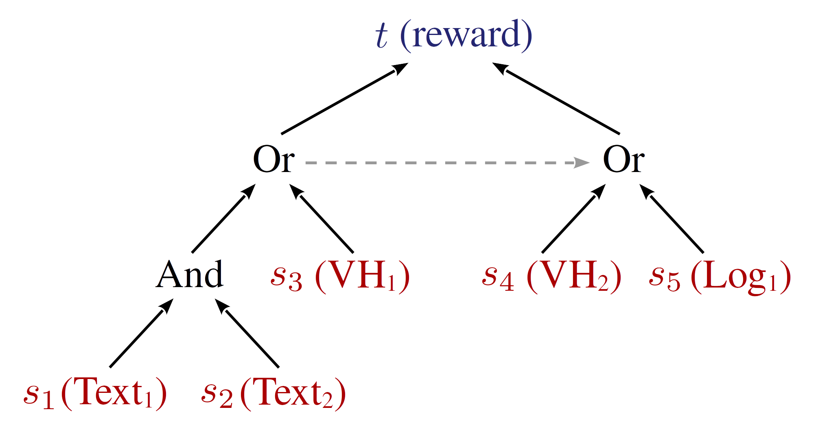

<!-- vimc: call SyntaxRange#Include('```ebnf', '```', 'ebnf', 'NonText'): -->
<!-- vimc: call SyntaxRange#Include('```proto', '```', 'proto', 'NonText'): -->
<!-- vimc: call SyntaxRange#Include('```sh', '```', 'sh', 'NonText'): -->

## Extending a New App or a New Task Based on Mobile-Env

To extend a new task for the Mobile-Env platform, you need to prepare:

+ The installation package of the corresponding Android app
+ The external data, *e.g.*, the crawled online data
+ The definition of the task meta-information in textproto format, including
  the task id, the description, the setup steps, the task events, *etc.*

### Preparation of the App Package

You need to prepare the installation package for the app and check if it can be
successfully launched and run on the emulator. Nowadays, most desktops have an
`amd64` CPU, however, most Android mobiles run on the `arm`-arch devices. Thus,
plenty of installation packages provide the binary libraries only for the `arm`
architecture. Our test reveals that, the image of Android 11 (API Level 30)
offers the best support for the `arm`-arch packages on the `amd64` desktops.

Here are several websites offering Android app package downloading:

* [APKCombo](https://apkcombo.com/)
* [APKPure](https://apkpure.com/)
* [CoolApk](https://www.coolapk.com/)

The supported architecture can be checked for the downloaded package on these
platforms, which can be taken as a reference. APKCombo may offer the packages
for various binary architectures. Other app platforms may be explored as well
    to find an available installation package file. We recommend that the
    available installation package or the acquisition approach be released
    together with the constructed task set.

While the installation package file is ready, the app package name and the
activity name of the main activity are to be noted for the task definition
file. In order to know the package name and the main activity name, you can
launch the emulator and install and run the target app, and then execute on the
host machine:

```sh
adb shell am stack list
```

This command will list all the running activities in the format of
`package_name/activity_name` like
`com.wikihow.wikihowapp/com.wikihow.wikihowapp.MainTabActivity`. Actually, the
package name is the certain name of the Java package, and the activity name is
just the name of the subclass of `android.app.Activity`. Besides, if the app is
in the store of Google Play, the package name can also be obtained from the
`id` field of the webpage's URL. For instance, `com.wikihow.wikihowapp` from
<https://play.google.com/store/apps/details?id=com.wikihow.wikihowapp> is the
package name.

### Preparation of the App Data

Many information apps rely on the Internet to provide dynamic contents.
Therefore, an enough amount of online contents are supposed to be crawled and
stored to guarantee the environment consistency during training and evaluation.
In this way, the agent designer can replay the data to the app through an MitM
proxy during his training and testing. The data should be released along with
the app package and the task definition files.

It is noted that several apps adopt a certificate pinning policy for its SSL
connection. Three [solutions](dynamic-app-zh.md) for this are tested and the
corresponding script tools are provided. When a new task set is released, you
are supposed to make sure that the used app will trust the certificate of the
MitM proxy or at least one of the solutions work if the certificate pinning
policy is adopted and give an explation in the release. If other solutions for
the certificate pinning beyond the recommended three ones is exploited, a guide
and the necessary tools should be provided.

### Definition of the Task Meta-Information

Mobile-Env presents the task meta-information in a `Task` message object of
[ProtoBuf](https://protobuf.dev/) 3. A `Task` message instance in textproto is
required for everay interaction task.

Some references:

* [The definition of `Task` message type](../android_env/proto/task.proto)
* [The document of ProtoBuf](https://protobuf.dev/)
* [The syntax definition of
  textproto](https://protobuf.dev/reference/protobuf/textformat-spec/)

If you are familiar with the syntax of ProtoBuf 3, we recommend you to compose
the task definition file directly with the help of [the definition of `Task`
message](../android_env/proto/task.proto), the following task definition demo,
and [the introduction to the task event management of
Mobile-Env](#definition-of-the-task-events). Otherwise you are recommended to
read the following guides to the message types like `Task`. We will introduce
these types as detailed and clear as possible.

<!-- Task Definition Demo {{{ -->
<details>
    <summary>Here is a demo task definition. You can expand to view it.</summary>

```
id: "bake_lobster_tails-7"
name: "WikiHow Search Task - How to bake lobster tails"
description: "A demo task primitive requiring to search WikiHow for a specific article.\nA demo task primitive requiring to access a specific article.\nA demo task asking to check the reference list."

setup_steps: {
  adb_call: {
    install_apk: {
      filesystem: {
        path: "../wikiHow：万事指南_2.9.6_apkcombo.com.apk"
      }
    }
  }
}
setup_steps: {
  adb_call: {
    rotate: {
        orientation: PORTRAIT_0
    }
  }
}

reset_steps: {
  adb_call: {
    force_stop: {
      package_name: "com.wikihow.wikihowapp"
    }
  }
}
reset_steps: {
  adb_call: {
    clear_cache: {
      package_name: "com.wikihow.wikihowapp"
    }
  }
}
reset_steps: {
  success_condition: {
    num_retries: 10
    wait_for_app_screen: {
      app_screen: {
        activity: "com.wikihow.wikihowapp/com.wikihow.wikihowapp.MainTabActivity"
      }
      timeout_sec: 10.0
    }
  }
  adb_call: {
    start_activity: {
      full_activity: "com.wikihow.wikihowapp/com.wikihow.wikihowapp.MainTabActivity"
    }
  }
}
reset_steps: {
  adb_call: {
    start_screen_pinning: {
      full_activity: "com.wikihow.wikihowapp/com.wikihow.wikihowapp.MainTabActivity"
    }
  }
}

expected_app_screen: {
  activity: "com.wikihow.wikihowapp/com.wikihow.wikihowapp.MainTabActivity"
}

max_num_steps: 500

event_sources: {
  text_recognize: {
    expect: "\\b\\(bake\\|lobster\\|tails\\)\\b"
    rect: {
      x0: 0.2439
      y0: 0.0354
      x1: 0.9085
      y1: 0.1171
    }
  }
  id: 1
}
event_sources: {
  view_hierarchy_event: {
    view_hierarchy_path: "android.widget.FrameLayout"
    view_hierarchy_path: "android.widget.LinearLayout@com.wikihow.wikihowapp:id/action_bar_root"
    view_hierarchy_path: "android.widget.FrameLayout@android:id/content"
    view_hierarchy_path: "androidx.appcompat.widget.LinearLayoutCompat@com.wikihow.wikihowapp:id/action_search"
    view_hierarchy_path: "android.widget.LinearLayout@com.wikihow.wikihowapp:id/search_bar"
    view_hierarchy_path: "android.widget.LinearLayout@com.wikihow.wikihowapp:id/search_edit_frame"
    view_hierarchy_path: "android.widget.LinearLayout@com.wikihow.wikihowapp:id/search_plate"
    view_hierarchy_path: "android.widget.EditText@com.wikihow.wikihowapp:id/search_src_text"
    properties: {
      property_name: "text"
      pattern: "\\b\\(bake\\|lobster\\|tails\\)\\b"
    }
    properties: {
      property_name: "clickable"
      pattern: "true"
    }
  }
  id: 2
}
event_sources: {
  log_event: {
    filters: "jd:D"
    pattern: "\\bmUrl is: https://www\\.wikihow\\.com/wikiHowTo\\?search=.*(bake|lobster|tails).*"
  }
  id: 3
}

event_sources: {
  text_detect: {
    expect: "How to Bake Lobster Tails"
    rect: {
      y0: 0.19
      x1: 1.0
      y1: 0.3
    }
  }
  id: 5
}
event_sources: {
  log_event: {
    filters: "jd:D"
    pattern: "\\bmUrl is: https://www\\.wikihow\\.com/Bake-Lobster-Tails"
  }
  id: 6
}
event_sources: {
  view_hierarchy_event: {
    view_hierarchy_path: "android.widget.FrameLayout"
    view_hierarchy_path: "android.widget.LinearLayout@com.wikihow.wikihowapp:id/action_bar_root"
    view_hierarchy_path: "android.widget.FrameLayout@android:id/content"
    view_hierarchy_path: "android.drawerlayout.widget.DrawerLayout@com.wikihow.wikihowapp:id/drawer_layout"
    view_hierarchy_path: "android.webkit.WebView"
    view_hierarchy_path: "android.view.View@mw-mf-viewport"
    view_hierarchy_path: "android.view.View@mw-mf-page-center"
    view_hierarchy_path: "android.view.View@content_wrapper"
    view_hierarchy_path: "android.view.View@content_inner"
    view_hierarchy_path: "android.view.View@section_0"
    view_hierarchy_path: "android.widget.TextView"
    properties: {
      property_name: "text"
      pattern: "How to Bake Lobster Tails"
    }
  }
  id: 7
}

event_sources: {
  text_detect: {
    expect: "References"
    rect: {
      x1: 0.33
      y1: 1.0
    }
  }
  id: 9
}
event_sources: {
  log_event: {
    filters: "jd:D"
    pattern: "\\burl is: https://www\\.wikihow\\.com/Bake-Lobster-Tails\\?wh_an=1&amp=1#References\\b"
  }
  id: 10
}

event_slots: {
  reward_listener: {
    type: OR
    events: {
      event: {
        type: OR
        id: 4
        events: [
            { id: 1 },
            { id: 2 },
            { id: 3 }
        ]
        transformation: "y = 1"
      }
    }
    events: {
      event: {
        type: OR
        id: 8
        events: [
            { id: 5 },
            { id: 6 },
            { id: 7 }
        ]
        transformation: "y = 1"
      }
    }
    events: {
      event: {
        type: OR
        id: 11
        events: [
            { id: 9 },
            { id: 10 }
        ]
        transformation: "y = 1"
      }
    }
  }

  episode_end_listener: {
    events: {
      id: 11
    }
    transformation: "y = True"
  }

  instruction_listener: {
    type: OR
    events: {
      event: {
        events: {
          id: 4
        }
        transformation: "y = [\'Access the article \"How to Bake Lobster Tails\"\']"
      }
    }
    events: {
      event: {
        events: {
          id: 8
        }
        transformation: "y = [\'Check the reference list\']"
      }
    }
  }
}
command: "Search an article to learn how to bake lobster tails."
command: "Then, access the article \"How to Bake Lobster Tails\""
command: "Then, check the reference list"
vocabulary: ["how to", "tails", "lobster", "bake"]
```
</details>
<!-- }}} Task Definition Demo -->

To instantiate a `Task` message, the following parameters need to be specified:

1. `id` - A string as the task id to identify the tasks. It is recommended that
   the id comprises only English letters, digits, the underscore and the score.
2. `name` - A string. This field gives a readable task name.
3. `description` - A string briefly explaining the task.
4. `setup_steps` - An array of `SetupStep` messages defining the config
   behaviours to set up a task.
5. `reset_steps` - An array of `SetupStep` messages defining the config
   behaviours during the lauching or restarting of the task.
6. `expected_app_screen` - Optional. This field specifies the running activity
   name and the characteristics of the screen which is used by the platform to
   determine whether the agent has quitted the task app mistakingly during the
   interaction. If it is, the platform will restart the episode in time.
7. `max_duration_sec` - A floating number. If the episode fails to end in the
   given seconds, the platform will force it to restart. You can ignore this
   field or set a non-positive number to disable this function.
8. `max_num_steps` - An integer. Similar to `max_duration_sec`, the platform
   will restart the episode if it does not end after the specified steps.
   Ignoring this field or setting a non-positive number will disable this
   function.
9. `event_sources` - Defines the task event sources.
10. `event_slots` - Defines the virtual event trees connected to the task event
    slots.
11. `extra_spec` - Defines the specification of the task extras. This is kept
    for the compatility of AndroidEnv.
12. `command` - An array of string providing a description or a global command
    for the task target which will be sent to the agent.
13. `vocabulary` - An array of string providing a tiny vocabulary corresponding
    to the task. This vocabulary can be used to remit the difficulty of the
    task and the annotation of human demonstration.

More message types are in need to define `setup_steps`, `reset_steps`,
`expected_app_screen`, `event_sources`, and `event_slots` and will be
introduced below.

### `SetupStep` Message

<!-- `SetupStep` Message {{{ -->
A `SetupStep` array is required by the `setup_steps` and `reset_steps` fields.
Each `SetupStep` message defines a config step.

The `SetupStep` message defines two fields:

* `success_condition` - Defines an operation to check if the config succeeds.
* `step` - Defines the certain config operation.

At least one field should be defined. The `step` will be executed first to
complete the config, then the `success_condition` will be executed to check the
success if both fields are specified.

A message object is required for `success_condition`, which contains two
fields:

<!-- `success_condition` Field {{{ -->
<details>
    <summary>The details about the `success_condition` field.</summary>

* `num_retries` - The maximum attempt times if the config fails. The platform
  will try at least 3 times even though it is ignored or a value smaller than 3
  is specified.
* `check` - The certain check operation.

`check` is an exclusive field decorated with [`oneof`
keyword](https://protobuf.dev/programming-guides/proto3/#oneof). Only one
sub-field should be chosen from three options. The options are:

* `wait_for_app_screen` - Requires to wait for a specific screen. An
  `AppScreen` message should be provided through the `app_screen` field. The
  `AppScreen` message determines a screen through the activity name and the
  view hierarchy (VH) characteristics of the screen. The details will be
  presented in the following sections.
* `check_install` - Checks if a specific app package is installed through a
  command. The package name is specified through the `package_name` field.
* `wait_for_message` - Waits for a specific message from the system logs. A
  regex for the waited message is expected to provide through the `message`
  field. The regex's syntax follows the [`re` module of
  Python](https://docs.python.org/3/library/re.html).

Besides, all the aforementioned three operations require a float field
`timeout_sec` to specify the waiting time, *e.g.*, 10 seconds. If the
`timeout_sec` field is ignored, then this check will not be executed.
</details>
<!-- }}} `success_condition` Field -->

`step` is also a `oneof` field with two options:

* `sleep` - Requires a message in which the sleeping seconds should be
  specified through the float field `time_sec`.
* `adb_call` - An `AdbCall` message object is required to revoke the ADB.

<!-- `AdbCall` Message {{{ -->
<details>
    <summary>The details about the `AdbCall` message.</summary>

`AdbCall` message is defined in
[`android_env/proto/adb.proto`](../android_env/proto/adb.proto) and supports
many kinds of operations. Some frequently-used operations comprise:

* `install_apk` - Installs a package. The path to the apk package is expected
  from the string field `path` of the message field `filesystem`. The path can
  be specified either as a relative path to the current `textproto` file or as
  an absolute path (not recommended).
* `force_stop` - Forces a process to terminate according to the package name
  provided by `package_name`.
* `clear_cache` - Clears the app's cache according to the package name provided
  by `package_name`.
* `start_activity` - Launches an Android activity whose name is specified by
  `full_activity`. The format of the Android activity names are
  `package_name/activity_name`, *e.g.*,
  `com.wikihow.wikihowapp/com.wikihow.wikihowapp.MainTabActivity`.
* `start_screen_pinning` - Enables screen pinning. After enabling, the Android
  system will switch back to the certain activity if an exit is detected. The
  activity name should be specified through `full_activity`.
</details>
<!-- }}} `AdbCall` Message -->
<!-- }}} `SetupStep` Message -->

### `AppScreen` Message

<!-- `AppScreen` Message {{{ -->
An `AppScreen` message object is required as the argument by both
`expected_app_screen` and `wait_for_app_screen`. This type of message needs two
parameters:

+ `activity` - A string indicating the name of the Android activity. The format
  of the Android activity names is `package_name/activity_name`, *e.g.*,
  `com.wikihow.wikihowapp/com.wikihow.wikihowapp.MainTabActivity`.
+ `view_hierarchy_path` - An array of string requiring a VH path.  Each array
  element turns to be a regex which matches an item on the path. The VH path
  comprises a VH node sequence from the top to the bottom. It is not necessary
  to provide the nodes consecutively.

It is worth noting that, the representation of the nodes in
`AppScreen.view_hierarchy_path` is the same with the output of the command `adb
shell dumpsys`, *i.e.* the output of `android.view.View::toString`. This is a
quite compat format and hard to read. However, in most cases, this property can
be ignored, because this property will locates to a specific page while most
InfoUI interaction tasks require transfering between different pages of the
app. Consequently, this property shouldn't be used to fix the interaction to a
specific page. If you really need to give a value for this property, you can
refer to the following example:

<details>
    <summary>The example of the `view_hierarchy_path` property</summary>

```
view_hierarchy_path: [
    "^DecorView@.*\[MainActivity\]$",
    "^android.widget.LinearLayout\{.*\}$",
    "^android.widget.FrameLayout\{.*android\:id\/content\}",
    "^android.widget.RelativeLayout\{.*\}",
    "^android.widget.FrameLayout\{.*app\:id\/fragment_holder\}",
    "^android.widget.RelativeLayout\{.*\}",
    "^com.google.example.games.nostalgicracer.views.RaceView3D\{.*app\:id\/gameplay_screen_3d\}",
]
```
</details>

If you really need to specify a node's property detailed, you can refer to the
following EBNF and the source code of `android.view.View::toString`.

<!-- The Output Format and Source Code of View::toString {{{ -->
<details>
    <summary>Expand to check the output format and the source code of
    `android.view.View::toString`.</summary>

The EBNF definition of the output format of `android.view.View::toString`:

```ebnf
view-hierarchy-line = class-name
    , "{" object-hash-code
    , " " view-flags
    , " " private-flags
    , " " bbox
    , [ " #" element-id-code
        , [ " " resource-package-name
            , ":" resource-type-name
            , "/" resource-entry-name
        ]
    ] "}" ;

view-flags = visibility-flag
    , focusable-flag
    , enabled-flag
    , draw-flag
    , scrollbars-horizontal
    , scrollbars-vertical
    , clickable
    , long-clickable
    , context-clickable ;

private-flags = is-root-namespace
    , focused
    , selected
    , pressed-flag
    , hovered
    , activated
    , invalidated
    , dirty-flag ;

bbox = left "," top "-" right "," bottom ;
left = integer-symbol ;
top = integer-symbol ;
right = integer-symbol ;
bottom = integer-symbol ;

visibility-flag = "V" (* Visible *)
    | "I" (* Invisible *)
    | "G" (* Gone *)
    | "." ;
focusable-flag = "F" | "." ;
enabled-flag = "E" | "." ;
draw-flag = "D" (* Will Draw *)
    | "." ;
scrollbars-horizontal = "H" | "." ;
scrollbars-vertical = "V" | "." ;
clickable = "C" | "." ;
long-clickable = "L" | "." ;
context-clickable = "X" | "." ;

is-root-namespace = "R" | "." ;
focused = "F" | "." ;
selected = "S" | "." ;
pressed-flag = "p" (* Prepressed *)
    | "P" (* Pressed *)
    | "." ;
hovered = "H" | "." ;
activated = "A" | "." ;
invalidated = "I" | "." ;
dirty-flag = "D" | "." ;
```

The source code of `android.view.View::toString` from Android API 27:

```java
public String toString() {
	StringBuilder out = new StringBuilder(128);
	out.append(getClass().getName());
	out.append('{');
	out.append(Integer.toHexString(System.identityHashCode(this)));
	out.append(' ');
	switch (mViewFlags&VISIBILITY_MASK) {
		case VISIBLE: out.append('V'); break;
		case INVISIBLE: out.append('I'); break;
		case GONE: out.append('G'); break;
		default: out.append('.'); break;
	}
	out.append((mViewFlags & FOCUSABLE) == FOCUSABLE ? 'F' : '.');
	out.append((mViewFlags&ENABLED_MASK) == ENABLED ? 'E' : '.');
	out.append((mViewFlags&DRAW_MASK) == WILL_NOT_DRAW ? '.' : 'D');
	out.append((mViewFlags&SCROLLBARS_HORIZONTAL) != 0 ? 'H' : '.');
	out.append((mViewFlags&SCROLLBARS_VERTICAL) != 0 ? 'V' : '.');
	out.append((mViewFlags&CLICKABLE) != 0 ? 'C' : '.');
	out.append((mViewFlags&LONG_CLICKABLE) != 0 ? 'L' : '.');
	out.append((mViewFlags&CONTEXT_CLICKABLE) != 0 ? 'X' : '.');
	out.append(' ');
	out.append((mPrivateFlags&PFLAG_IS_ROOT_NAMESPACE) != 0 ? 'R' : '.');
	out.append((mPrivateFlags&PFLAG_FOCUSED) != 0 ? 'F' : '.');
	out.append((mPrivateFlags&PFLAG_SELECTED) != 0 ? 'S' : '.');
	if ((mPrivateFlags&PFLAG_PREPRESSED) != 0) {
		out.append('p');
	} else {
		out.append((mPrivateFlags&PFLAG_PRESSED) != 0 ? 'P' : '.');
	}
	out.append((mPrivateFlags&PFLAG_HOVERED) != 0 ? 'H' : '.');
	out.append((mPrivateFlags&PFLAG_ACTIVATED) != 0 ? 'A' : '.');
	out.append((mPrivateFlags&PFLAG_INVALIDATED) != 0 ? 'I' : '.');
	out.append((mPrivateFlags&PFLAG_DIRTY_MASK) != 0 ? 'D' : '.');
	out.append(' ');
	out.append(mLeft);
	out.append(',');
	out.append(mTop);
	out.append('-');
	out.append(mRight);
	out.append(',');
	out.append(mBottom);
	final int id = getId();
	if (id != NO_ID) {
		out.append(" #");
		out.append(Integer.toHexString(id));
		final Resources r = mResources;
		if (id > 0 && Resources.resourceHasPackage(id) && r != null) {
			try {
				String pkgname;
				switch (id&0xff000000) {
					case 0x7f000000:
						pkgname="app";
						break;
					case 0x01000000:
						pkgname="android";
						break;
					default:
						pkgname = r.getResourcePackageName(id);
						break;
				}
				String typename = r.getResourceTypeName(id);
				String entryname = r.getResourceEntryName(id);
				out.append(" ");
				out.append(pkgname);
				out.append(":");
				out.append(typename);
				out.append("/");
				out.append(entryname);
			} catch (Resources.NotFoundException e) {
			}
		}
	}
	out.append("}");
	return out.toString();
}
```
</details>
<!-- }}} The Output Format and Source Code of View::toString -->
<!-- }}} `AppScreen` Message -->

### Definition of the Task Events

The fields `event_sources` and `event_slots` are used for the definition of the
task events. A tree-based event system is designed for Mobile-Env to manage the
task events. The event system comprises 6 event slots and the tree of virtual
events connected to the slots. The event slots are corresponding to the events
that the agent will have a perception to:

+ Score event (`score_listener`)
+ Reward event (`reward_listener`)
+ Episode end event (`episode_end_listener`)
+ Instruction event (`instruction_listener`)
+ Extra info event (`extra_listener`)
+ JSON extra info event (`json_extra_listener`)

There are two types of virtual events: the event sources and the combinators.
Usually, the event sources constitute the leaf nodes of the event tree and are
corresponding to the specific feedbacks from the Android operating system (OS).
They are:

+ Screen texts (`text_recognize`, `text_detect`)
+ Scrren icons (`icon_recognize`, `icon_detect`, `icon_match`,
  `icon_detect_match`)
+ View hierarchy (`view_hierarchy_event`)
+ System log (`log_event`)

There are three combinators: `And`, `Or`, and `SINGLE`, which are used to
combine or wrap the virtual events.

The platform will send the feedback signals from the OS to the defined event
sources after each step in the episode. The event sources will check if the
signal matches the defined pattern and decide whether the event should be
triggered or not. If the event is triggered, the signals will be applied to the
parent node. The combinator will first check whether its prerequisites are
satisfied, *i.e.*, the combinator can be triggered only if all the prerequisite
nodes have been triggered ever. This mechanism is designed to handle the
temporal sequence of the steps in the multi-step tasks. If the prerequisites
are satisfied, the combinator will decide the triggering according the
triggering flag of its child nodes. To be specific, the `Or` combinator will be
triggered once one of its children is triggered while the `And` combinator will
be triggered only all its children is triggered and the `SINGLE` combinator
will follow the state of its sole child. If the combinator is triggered, the
signals will be applied to its parent as well. The signals will be processed
level by level and be aggregated to the root node. Then the root node will pass
it to the slot and the slot will send it as a feedback to the agent.



This demo event tree is connected to the reward event slot. The event sources
with the combinators form a tree-like event logic. The `SINGLE` combinator is
not depicted in the figure.

#### Event Sources and Event Slots

##### The Input and Output of the Event Sources

This section will introduce the system feedbacks listend by the event sources
and their outputs applied to the parent nodes.

The two kinds of screen text event sources listen the the text contents on the
screen, which should be enabled by an external OCR module. The source with
detection will run a detection model to detect the text instances in the
specified region before recognizing the certain contents, while the source with
only recognition directly run the recognition model on the assumption that the
specified region is close to the text instance's bounds. After the contents are
recognized, the platform will try to match the results by the regex in the
event source definition. If the results match the regex and the triggering
condition is satisfied, this event will be triggered. Then the text event
source will return a tuple comprising all the captured groups, which is just
the returning value of
[`re.Match.groups`](https://docs.python.org/3/library/re.html#re.Match.groups).

The four kinds of screen icon event sources listen to the icons on the screen,
which should be enabled by an external icon recognition and matching module.
The source with detection will fisrt invoke the detection model and then the
recognition or mathing model, which is the same with the text sources. The
sources for recognition will classify the icon instance using a recognition
model and check if the predition matches the class in the evenet source
definition. In contrast, a source for matching will task a mathing model to
decide if the input icon instance matches with a reference image. If the
classfication is right or the reference is matched, the event source will be
triggered according to the aforementioned triggering conditions. If the event
source is triggered, a boolean true `True` will be returned to the parent.

A VH event source will take the VH of the current screen and check if there is
a specific node and if the node's properties satisfy some constraints. If the
node exists and the constraints for its properties are satisfied, the event
source will be triggered according to the aforementioned triggering conditions.
A triggered event source will return a list storing the values of the checked
properties. However, it is worth noting that the VH events will not be checked
after each step. Owing to the high latency of the acquisition through ADB and
the high length of the VH XML which will cause conflict of the output if the
request is too fast, the platform slows down the check frequency of the VH.
Consequently, there is no guarantee that the VH event source can be triggered
in time. Therefore, the crucial task events shouldn't rely solely on the VH
event sources.

A system log event source will listen to the runtime log of the system and
matches each line by the regex in the definition. If any line is matched and
the aforementioned triggering conditions are satisfied, the event source will
be triggered and return a tuple comprising all the regex-captured groups, which
is the same with the screen text event sources.

##### The Event Slots

This section will introduce the six kinds of event slots designed for the
platform. The event slots are corresponding to the event information that the
agents can have a perception to. At runtime, each slots will be connected with
an event tree so that the right event signals can be parsed from the feedbacks
of the OS.

The slots of the score event (`score_listener`) and the reward event
(`reward_listener`) are designed for the parsing of the reward which are to be
returned to the agent. Their difference is the explanation to the signal
received from the event tree. The score event slot regards the received signal
as an accumulated score, *i.e.*, the platform will subtract the last recorded
score from the novel one to get the single-step reward, if a score event is
triggered. In contrast, the reward event slot considers the received signal as
the single-step reward, thus the value will be returned directly. The resulted
single-step reward from these two slots will be added and then returned to the
agent.

The episode end event slot (`episode_end_listener`) indicated if the episode
comes to the end and the platform will restart the task at the next step. This
usually means that the agent has just achieved the task target. But it is also
possible that several severe errors have occured and the system cannot the
system cannot resume and has to restart. Only the triggering flag of the
episode end event slot makes sense and it returns no further values to the
agent.

The instruction event slot (`instruction_listener`) gives the agent the novel
step instructions which are generated during the interaction. This slot wants a
string list from the event tree, in which each element is a line or a sentence
of instruction.

The extra info and the JSON extra info is the task-specific extra info which is
not included in the observation and may assist the agent to make a decision,
which is proposed in AndroidEnv. The extra info event slot (`extra_listener`)
expects a dict like `Dict[str, List[Any]]` with the strings as the keys and the
lists storing some data as the values. The JSON extra info event slot
(`json_extra_listener`) expects a JSON string which should be parsed into the
same format with that of the extra slot. The signals from the two slots will be
mixed before returning to the agent.

#### Define the Event Sources through `event_sources`

The event sources receive the feedbacks from the OS and checks if they matches
some pattern and decide if the event should be triggered. The `Task` message
expects the defintions of the event sources through the `event_sources` field.
To define an event source, you need to specify three properties:

+ `event` - A `oneof` field defining the particular pattern to be recognized.
+ `id` - A 32-bit interger providing the unique id for the event source for
  refering. *The id is required to be a **positive** number*.
+ `repeatability` - An enum from `NONE`, `LAST`, and `UNLIMITED`. This field
  indicates if the event should be triggered repeatedly when the pattern
  defined by `event` is satisfied continuously. The value defaults to `NONE`.
  - `NONE` indicates to never trigger again, *i.e.*, the event can be triggered
    by one input only once in an episode.
  - `LAST` indicates not to trigger continuously. If the identical input
    matched with the pattern is met continuously, then only the first match
    will trigger the event. However, if the identical input is met again after
    some different inputss the event can be triggered as usual.
  - `UNLIMITED` conducts no constraints for the repeatability, Once the
    platform meets the defined pattern, the event will be triggered.

The options of `event` is the aforementioned event sources:

+ `text_recognize`, `text_detect` - These two sources recognize/detect the text
  contents in the particular region on the screen. The required fields are
  + `expect` - A regex for the expected texts.
  + `rect` - Expects a message with four float properties: `x0`, `y0`, `x1`,
    and `y1` to indicate the screen region where the recognition/detection is
    conducted. The coordinates are expected to be normalized to `[0, 1`].
+ `icon_recognize`, `icon_detect` - These two sources recognize/detect the icon
  contents in the particular region on the screen. These needs:
  + `class` - A string as the certain name of the icon class. The name set
    depends on the mounted icon model.
  + `rect` - Gives the region for the recognition/detection, which is the same
    with the text event sources.

<!-- TODO -->
