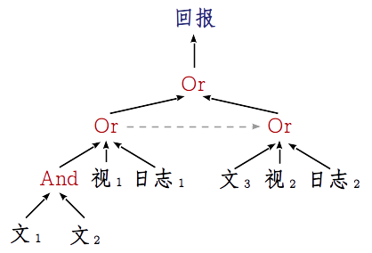

<!-- vim: set nospell: -->
<!-- vimc: call SyntaxRange#Include('```ebnf', '```', 'ebnf', 'NonText'): -->
<!-- vimc: call SyntaxRange#Include('```proto', '```', 'proto', 'NonText'): -->
<!-- vimc: call SyntaxRange#Include('```sh', '```', 'sh', 'NonText'): -->

## 基于Mobile-Env扩展新环境（手机应用）或新任务

为Mobile-Env平台扩展新环境需要准备：

+ 任务涉及的应用的安装包
+ 所需的在线数据等其他外部数据

为Mobile-Env平台扩展任务需要提供

+ 任务定义文件，以[Protocol Buffers](https://protobuf.dev/)（ProtoBuf）的文本格式提供，定义任务编号、任务描述、配置步骤、历程信号等信息

### 扩展新环境：准备应用安装包

需要为要扩展的应用准备安装包，并检查其能否在模拟器上顺利安装并启动运行。现今大多数电脑的处理器架构都是`amd64`，而绝大多数安卓手机则都运行于`arm`架构的硬件上，许多下载到的安装包也只提供了针对`arm`平台的二进制库。经过测试，`amd64`平台上，Android 11 (API Level 30)版本的安卓镜像对`arm`架构的安装包支持得最好。

一些可以下载应用安装包的网站：

* [APKCombo](https://apkcombo.com/)
* [APKPure](https://apkpure.com/)
* [酷安](https://www.coolapk.com/)

从这些应用平台上下载安装包时可以查看该安装包支持的二进制平台，该信息可以作为参考；APKCombo上还会提供面向不同二进制平台构建的安装包；也可以试着找一找更多提供安卓安装包的网站来找到能够使用的应用安装包。本平台建议，在发布新环境或新任务集时，应将能够使用的安装包，或获取之的方式一并发布。

### 扩展新环境：准备应用数据

许多信息类应用依赖互联网来提供动态的内容，这些内容会依用户的时空条件变化。为了保证测试与训练过程中环境的一致，需要事先爬取足量的在线内容并将之固定下来，这样，智能体设计者就可以在使用平台测试训练其智能体时，通过中间人代理工具模拟在线服务器，将在线内容回放给应用程序。这些数据应该同应用安装包（及任务定义文件）等一起发布。

同时，由于许多应用基于SSL加密传输其数据时，采取了固定证书的策略，本平台试验了三种[解决方案](dynamic-app-zh.md)来解除其证书固定，并提供了相应的脚本工具。新环境发布时，需要事先测试好，保证所使用的应用程序能够信任采用的中间人代理工具的证书，否则，若其采用了固定证书策略，则应保证至少一种解除证书固定的方案有效，并在发布时说明；若采用了三种推荐解决方案之外的方式解除证书固定，那么应在发布时介绍采用的方法，并为之提供必要的工具。

### 包名与主活动名

应用的包名和主活动名，在任务定义文件中会用到。要获取应用的包名与主活动名，可以启动模拟器，安装、运行目标应用，然后在宿主机上执行以下命令：

```sh
adb shell am stack list
```

该命令会列出虚拟机上所有正在运行的活动，列出的格式是`包名/活动名`，如`com.wikihow.wikihowapp/com.wikihow.wikihowapp.MainTabActivity`。其中包名就是Java包的名称，活动名是`android.app.Activity`的子类的类名。此外，对在谷歌应用商店中上架的应用，也可以查看应用商店网页版网址中`id`字段的值，如<https://play.google.com/store/apps/details?id=com.wikihow.wikihowapp>中的`com.wikihow.wikihowapp`。

### 扩展新任务：任务定义文件

任务定义文件定义一个任务所必须的配置，包括设置操作、任务目标、步骤指令、回报、历程结束等。Mobile-Env的任务定义文件采用[ProtoBuf](https://protobuf.dev/) 3（Protocol Buffers 3）的文本格式。每个任务定义都表示为一个`Task`消息对象。

相关参考文档：

* [`Task`消息类型的详细定义](../android_env/proto/task.proto)
* [Protocol Buffers文档](https://protobuf.dev/)
* [Protocol Buffers的文本格式的语法说明](https://protobuf.dev/reference/protobuf/textformat-spec/)

若您熟悉ProtoBuf 3的语法，推荐您直接参考[`Task`消息的定义](../android_env/proto/task.proto)、下面给出的示例任务定义，并参照后文[对Mobile-Env中管理历程信号及其时机的介绍](#扩展新任务-管理历程信号的时机)，编写任务定义文件。否则您可以阅读后文对`Task`等消息类型的介绍，本文会尽可能将之介绍得详细清晰。

<!-- 任务定义示例 {{{ -->
<details>
    <summary>这里提供了一份任务定义示例，可以展开查看</summary>

```
id: "bake_lobster_tails-7"
name: "WikiHow Search Task - How to bake lobster tails"
description: "A demo task primitive requiring to search WikiHow for a specific article.\nA demo task primitive requiring to access a specific article.\nA demo task asking to check the reference list."

setup_steps: {
  adb_call: {
    install_apk: {
      filesystem: {
        path: "../wikiHow：万事指南_2.9.6_apkcombo.com.apk"
      }
    }
  }
}
setup_steps: {
  adb_call: {
    rotate: {
        orientation: PORTRAIT_0
    }
  }
}

reset_steps: {
  adb_call: {
    force_stop: {
      package_name: "com.wikihow.wikihowapp"
    }
  }
}
reset_steps: {
  adb_call: {
    clear_cache: {
      package_name: "com.wikihow.wikihowapp"
    }
  }
}
reset_steps: {
  success_condition: {
    num_retries: 10
    wait_for_app_screen: {
      app_screen: {
        activity: "com.wikihow.wikihowapp/com.wikihow.wikihowapp.MainTabActivity"
      }
      timeout_sec: 10.0
    }
  }
  adb_call: {
    start_activity: {
      full_activity: "com.wikihow.wikihowapp/com.wikihow.wikihowapp.MainTabActivity"
    }
  }
}
reset_steps: {
  adb_call: {
    start_screen_pinning: {
      full_activity: "com.wikihow.wikihowapp/com.wikihow.wikihowapp.MainTabActivity"
    }
  }
}

expected_app_screen: {
  activity: "com.wikihow.wikihowapp/com.wikihow.wikihowapp.MainTabActivity"
}

max_num_steps: 500

event_sources: {
  text_recognize: {
    expect: "\\b\\(bake\\|lobster\\|tails\\)\\b"
    rect: {
      x0: 0.2439
      y0: 0.0354
      x1: 0.9085
      y1: 0.1171
    }
  }
  id: 1
}
event_sources: {
  view_hierarchy_event: {
    view_hierarchy_path: "android.widget.FrameLayout"
    view_hierarchy_path: "android.widget.LinearLayout@com.wikihow.wikihowapp:id/action_bar_root"
    view_hierarchy_path: "android.widget.FrameLayout@android:id/content"
    view_hierarchy_path: "androidx.appcompat.widget.LinearLayoutCompat@com.wikihow.wikihowapp:id/action_search"
    view_hierarchy_path: "android.widget.LinearLayout@com.wikihow.wikihowapp:id/search_bar"
    view_hierarchy_path: "android.widget.LinearLayout@com.wikihow.wikihowapp:id/search_edit_frame"
    view_hierarchy_path: "android.widget.LinearLayout@com.wikihow.wikihowapp:id/search_plate"
    view_hierarchy_path: "android.widget.EditText@com.wikihow.wikihowapp:id/search_src_text"
    properties: {
      property_name: "text"
      pattern: "\\b\\(bake\\|lobster\\|tails\\)\\b"
    }
    properties: {
      property_name: "clickable"
      pattern: "true"
    }
  }
  id: 2
}
event_sources: {
  log_event: {
    filters: "jd:D"
    pattern: "\\bmUrl is: https://www\\.wikihow\\.com/wikiHowTo\\?search=.*(bake|lobster|tails).*"
  }
  id: 3
}

event_sources: {
  text_detect: {
    expect: "How to Bake Lobster Tails"
    rect: {
      y0: 0.19
      x1: 1.0
      y1: 0.3
    }
  }
  id: 5
}
event_sources: {
  log_event: {
    filters: "jd:D"
    pattern: "\\bmUrl is: https://www\\.wikihow\\.com/Bake-Lobster-Tails"
  }
  id: 6
}
event_sources: {
  view_hierarchy_event: {
    view_hierarchy_path: "android.widget.FrameLayout"
    view_hierarchy_path: "android.widget.LinearLayout@com.wikihow.wikihowapp:id/action_bar_root"
    view_hierarchy_path: "android.widget.FrameLayout@android:id/content"
    view_hierarchy_path: "android.drawerlayout.widget.DrawerLayout@com.wikihow.wikihowapp:id/drawer_layout"
    view_hierarchy_path: "android.webkit.WebView"
    view_hierarchy_path: "android.view.View@mw-mf-viewport"
    view_hierarchy_path: "android.view.View@mw-mf-page-center"
    view_hierarchy_path: "android.view.View@content_wrapper"
    view_hierarchy_path: "android.view.View@content_inner"
    view_hierarchy_path: "android.view.View@section_0"
    view_hierarchy_path: "android.widget.TextView"
    properties: {
      property_name: "text"
      pattern: "How to Bake Lobster Tails"
    }
  }
  id: 7
}

event_sources: {
  text_detect: {
    expect: "References"
    rect: {
      x1: 0.33
      y1: 1.0
    }
  }
  id: 9
}
event_sources: {
  log_event: {
    filters: "jd:D"
    pattern: "\\burl is: https://www\\.wikihow\\.com/Bake-Lobster-Tails\\?wh_an=1&amp=1#References\\b"
  }
  id: 10
}

event_slots: {
  reward_listener: {
    type: OR
    events: {
      event: {
        type: OR
        id: 4
        events: [
            { id: 1 },
            { id: 2 },
            { id: 3 }
        ]
        transformation: "y = 1"
      }
    }
    events: {
      event: {
        type: OR
        id: 8
        events: [
            { id: 5 },
            { id: 6 },
            { id: 7 }
        ]
        transformation: "y = 1"
      }
    }
    events: {
      event: {
        type: OR
        id: 11
        events: [
            { id: 9 },
            { id: 10 }
        ]
        transformation: "y = 1"
      }
    }
  }

  episode_end_listener: {
    events: {
      id: 11
    }
    transformation: "y = True"
  }

  instruction_listener: {
    type: OR
    events: {
      event: {
        events: {
          id: 4
        }
        transformation: "y = [\'Access the article \"How to Bake Lobster Tails\"\']"
      }
    }
    events: {
      event: {
        events: {
          id: 8
        }
        transformation: "y = [\'Check the reference list\']"
      }
    }
  }
}
command: "Search an article to learn how to bake lobster tails."
command: "Then, access the article \"How to Bake Lobster Tails\""
command: "Then, check the reference list"
vocabulary: ["how to", "tails", "lobster", "bake"]
```
</details>
<!-- }}} 任务定义示例 -->

`Task`消息需要以下参数：

1. `id` - 字符串，任务编号，用来区分各任务，建议只包含英文字母、数字、下划线、短线
2. `name` - 字符串，易读的任务名称
3. `description` - 字符串，简要描述任务的信息
4. `setup_steps` - `SetupStep`消息数组，定义载入任务时需要的操作
5. `reset_steps` - `SetupStep`消息数组，定义启动或重启任务时需要的操作
6. `expected_app_screen` - 可空，定义交互过程中运行的安卓活动名和屏幕特征，平台会使用该配置检查交互过程中智能体是否错误退出了任务应用，若是，则会及时重启任务过程
7. `max_duration_sec` - 浮点数，若经过该值指定的秒后，任务过程仍未结束，则平台会强制重启任务过程，留空或设置非正值可以禁用该功能
8. `max_num_steps` - 整数，与`max_duration_sec`类似，但按照智能体的交互次数来计数，留空或设置非正值可以禁用该功能
9. `event_sources` - 定义事件源。事件源，见于[后文](#扩展新任务-管理历程信号的时机)及[论文](https://arxiv.org/abs/2305.08144)
10. `event_slots` - 定义历程信号如何触发。简述可见于[论文](https://arxiv.org/abs/2305.08144)，详情于[后文](#扩展新任务-管理历程信号的时机)介绍
11. `extra_spec` - 为与AndroidEnv兼容保留，定义任务额外信息的格式
12. `command` - 字符串数组，定义提供给智能体的任务目标总括说明
13. `vocabulary` - 字符串数组，提供与任务有关的小词表，可以缓解任务难度，或方便标注人类演示

其中`setup_steps`、`reset_steps`、`expected_app_screen`、`event_sources`、`event_slots`等字段，定义它们涉及其他消息类型，将在后面一一介绍。

### 扩展新任务：`SetupStep`消息

<!-- `SetupStep`消息 {{{ -->
`setup_steps`与`reset_steps`字段都需要提供`SetupStep`数组，数组中每个`SetupStep`消息定义一步设置操作。

`SetupStep`消息定义了两个字段：

* `success_condition` - 定义操作以检查当前步骤是否成功
* `step` - 定义具体操作

两个字段至少要定义其中一个，若二者皆定义，则会先执行`step`来设置，再执行`success_condition`以检查成功与否。

`success_condition`字段需要提供一个消息对象，包含两个字段：

<!-- `success_condition`字段 {{{ -->
<details>
    <summary>`success_condition`字段详情</summary>

* `num_retries` - 若设置失败，最大的尝试次数；最少为3次，即使留空或提供比3小的值，也会视作3次
* `check` - 具体的检查操作

`check`是由[`oneof`关键字](https://protobuf.dev/programming-guides/proto3/#oneof)修饰的多选一字段，即需要从三个可选字段中选择其一，可供选择的字段（操作）包括

* `wait_for_app_screen` - 等待特定的屏幕内容，通过`app_screen`字段提供一条`AppScreen`消息，`AppScreen`消息会通过活动名和屏幕的视图框架（View Hierarchy）特征确定屏幕页面，有关它的详情请参考后文说明
* `check_install` - 检查指定的应用包是否已安装，通过`package_name`字段提供包名
* `wait_for_message` - 等待系统日志中特定的消息，需要通过`message`字段提供所等待消息的正则表达式，语法采用[Python的`re`模块支持的正则语法](https://docs.python.org/3/library/re.html)

此外，以上三类操作都还需要指定一个浮点数字段`timeout_sec`，以指定超时的时间，如10秒；若该字段留空，则整个检查步骤都不会执行。
</details>
<!-- }}} `success_condition`字段 -->

`step`字段的定义同样由`oneof`关键字修饰，其有两项候选：

* `sleep` - 休眠一段时间，通过浮点数字段`time_sec`指定休眠的秒数
* `adb_call` - 调用ADB命令，通过`AdbCall`消息以指定具体信息

<!-- `AdbCall`消息 {{{ -->
<details>
    <summary>`AdbCall`消息详情</summary>

`AdbCall`消息定义于[`android_env/proto/adb.proto`](../android_env/proto/adb.proto)，支持声明多种操作，常用的有：

* `install_apk` - 安装某安装包，需要为`filesystem`字段提供一条消息参数，内含字符串类型字段`path`，指定apk安装包的位置，可以采用相对于该`textproto`文件的路径，也可以采用绝对路径（不推荐）
* `force_stop` - 强制终止某进程，通过`package_name`提供应用的包名
* `clear_cache` - 清理应用包的缓存，通过`package_name`提供应用的包名
* `start_activity` - 启动某安卓活动，通过`full_activity`指定活动；指定安卓活动的格式是`包名/活动名`，如`com.wikihow.wikihowapp/com.wikihow.wikihowapp.MainTabActivity`
* `start_screen_pinning` - 开启固定屏幕功能；开启后，当安卓系统检测到屏幕上退出了指定的活动时，会自动切换回去；通过`full_activity`指定活动
</details>
<!-- }}} `AdbCall`消息 -->
<!-- }}} `SetupStep`消息 -->

### 扩展新任务：`AppScreen`消息

<!-- `AppScreen`消息 {{{ -->
`expected_app_screen`与`wait_for_app_screen`都需要提供`AppScreen`消息对象作为参数。该消息类型需要两个参数：

+ `activity` - 字符串，指定所等待的安卓活动；指定安卓活动的格式是`包名/活动名`，如`com.wikihow.wikihowapp/com.wikihow.wikihowapp.MainTabActivity`
+ `view_hierarchy_path` - 字符串数组，提供一串视图框架（View Hierarchy）路径，数组中每一个元素都是正则表达式，匹配路径上的一项。视图框架路径为从根至叶的一条视图框架节点序列，路径上的节点可以不连续提供。

需要注意，`AppScreen.view_hierarchy_path`中，用来表示每个节点的方式，与`adb shell dumpsys`命令输出的视图框架中相同，其实也就是`android.view.View::toString`的输出格式。该格式将节点的各种属性表示得非常紧凑，并不易读。好在一般并不需要指定该属性，因为该属性会指定到某个具体的页面，而大多信息界面交互任务需要在应用的不同页面间跳转，因此不应该利用该属性将交互固定到某一特定页面。若确有必要指定该属性，可以参考如下示例：

<details>
    <summary>`view_hierarchy_path`属性示例</summary>

```
view_hierarchy_path: [
    "^DecorView@.*\[MainActivity\]$",
    "^android.widget.LinearLayout\{.*\}$",
    "^android.widget.FrameLayout\{.*android\:id\/content\}",
    "^android.widget.RelativeLayout\{.*\}",
    "^android.widget.FrameLayout\{.*app\:id\/fragment_holder\}",
    "^android.widget.RelativeLayout\{.*\}",
    "^com.google.example.games.nostalgicracer.views.RaceView3D\{.*app\:id\/gameplay_screen_3d\}",
]
```
</details>

若实有进一步详细指定节点属性的需求，可以参考如下EBNF定义及`android.view.View::toString`的源代码。

<!-- View::toString的输出格式与源码 {{{ -->
<details>
    <summary>展开查看`android.view.View::toString`的输出格式与源代码</summary>

`android.view.View::toString`的输出格式定义：

```ebnf
view-hierarchy-line = class-name
    , "{" object-hash-code
    , " " view-flags
    , " " private-flags
    , " " bbox
    , [ " #" element-id-code
        , [ " " resource-package-name
            , ":" resource-type-name
            , "/" resource-entry-name
        ]
    ] "}" ;

view-flags = visibility-flag
    , focusable-flag
    , enabled-flag
    , draw-flag
    , scrollbars-horizontal
    , scrollbars-vertical
    , clickable
    , long-clickable
    , context-clickable ;

private-flags = is-root-namespace
    , focused
    , selected
    , pressed-flag
    , hovered
    , activated
    , invalidated
    , dirty-flag ;

bbox = left "," top "-" right "," bottom ;
left = integer-symbol ;
top = integer-symbol ;
right = integer-symbol ;
bottom = integer-symbol ;

visibility-flag = "V" (* Visible *)
    | "I" (* Invisible *)
    | "G" (* Gone *)
    | "." ;
focusable-flag = "F" | "." ;
enabled-flag = "E" | "." ;
draw-flag = "D" (* Will Draw *)
    | "." ;
scrollbars-horizontal = "H" | "." ;
scrollbars-vertical = "V" | "." ;
clickable = "C" | "." ;
long-clickable = "L" | "." ;
context-clickable = "X" | "." ;

is-root-namespace = "R" | "." ;
focused = "F" | "." ;
selected = "S" | "." ;
pressed-flag = "p" (* Prepressed *)
    | "P" (* Pressed *)
    | "." ;
hovered = "H" | "." ;
activated = "A" | "." ;
invalidated = "I" | "." ;
dirty-flag = "D" | "." ;
```

摘自Android API 27的`android.view.View::toString`源代码：

```java
public String toString() {
	StringBuilder out = new StringBuilder(128);
	out.append(getClass().getName());
	out.append('{');
	out.append(Integer.toHexString(System.identityHashCode(this)));
	out.append(' ');
	switch (mViewFlags&VISIBILITY_MASK) {
		case VISIBLE: out.append('V'); break;
		case INVISIBLE: out.append('I'); break;
		case GONE: out.append('G'); break;
		default: out.append('.'); break;
	}
	out.append((mViewFlags & FOCUSABLE) == FOCUSABLE ? 'F' : '.');
	out.append((mViewFlags&ENABLED_MASK) == ENABLED ? 'E' : '.');
	out.append((mViewFlags&DRAW_MASK) == WILL_NOT_DRAW ? '.' : 'D');
	out.append((mViewFlags&SCROLLBARS_HORIZONTAL) != 0 ? 'H' : '.');
	out.append((mViewFlags&SCROLLBARS_VERTICAL) != 0 ? 'V' : '.');
	out.append((mViewFlags&CLICKABLE) != 0 ? 'C' : '.');
	out.append((mViewFlags&LONG_CLICKABLE) != 0 ? 'L' : '.');
	out.append((mViewFlags&CONTEXT_CLICKABLE) != 0 ? 'X' : '.');
	out.append(' ');
	out.append((mPrivateFlags&PFLAG_IS_ROOT_NAMESPACE) != 0 ? 'R' : '.');
	out.append((mPrivateFlags&PFLAG_FOCUSED) != 0 ? 'F' : '.');
	out.append((mPrivateFlags&PFLAG_SELECTED) != 0 ? 'S' : '.');
	if ((mPrivateFlags&PFLAG_PREPRESSED) != 0) {
		out.append('p');
	} else {
		out.append((mPrivateFlags&PFLAG_PRESSED) != 0 ? 'P' : '.');
	}
	out.append((mPrivateFlags&PFLAG_HOVERED) != 0 ? 'H' : '.');
	out.append((mPrivateFlags&PFLAG_ACTIVATED) != 0 ? 'A' : '.');
	out.append((mPrivateFlags&PFLAG_INVALIDATED) != 0 ? 'I' : '.');
	out.append((mPrivateFlags&PFLAG_DIRTY_MASK) != 0 ? 'D' : '.');
	out.append(' ');
	out.append(mLeft);
	out.append(',');
	out.append(mTop);
	out.append('-');
	out.append(mRight);
	out.append(',');
	out.append(mBottom);
	final int id = getId();
	if (id != NO_ID) {
		out.append(" #");
		out.append(Integer.toHexString(id));
		final Resources r = mResources;
		if (id > 0 && Resources.resourceHasPackage(id) && r != null) {
			try {
				String pkgname;
				switch (id&0xff000000) {
					case 0x7f000000:
						pkgname="app";
						break;
					case 0x01000000:
						pkgname="android";
						break;
					default:
						pkgname = r.getResourcePackageName(id);
						break;
				}
				String typename = r.getResourceTypeName(id);
				String entryname = r.getResourceEntryName(id);
				out.append(" ");
				out.append(pkgname);
				out.append(":");
				out.append(typename);
				out.append("/");
				out.append(entryname);
			} catch (Resources.NotFoundException e) {
			}
		}
	}
	out.append("}");
	return out.toString();
}
```
</details>
<!-- }}} View::toString的输出格式与源码 -->
<!-- }}} `AppScreen`消息 -->

### 扩展新任务：管理历程信号及其时机

`event_sources`、`event_slots`两个字段与定义任务事件有关。Mobile-Env采用一套基于事件树的系统来管理任务事件。该系统由6个事件槽及与槽连接的虚拟事件树构成。事件槽对应于智能体能够感知到的回报、历程终点、步骤指令、额外信息等事件，分别为

+ 分数事件`score_listener`
+ 回报事件`reward_listener`
+ 历程终点事件`episode_end_listener`
+ 指令事件`instruction_listener`
+ 额外信息事件`extra_listener`
+ JSON信息事件`json_extra_listener`

虚拟事件可分为两类：事件源与组合算子。事件源通常是事件树的叶子节点，关联于特定的安卓操作系统反馈：包括

+ 屏幕文本（`text_recognize`、`text_detect`）
+ 屏幕图标（`icon_recognize`、`icon_detect`、`icon_match`、`icon_detect_match`）
+ 视图框架（`view_hierarchy_event`）
+ 运行日志（`log_event`）

组合算子则包括三个：`And`、`Or`、`SINGLE`，用来组合或包装虚拟事件。

交互过程中，每部交互后，平台都会将操作系统的反馈信号送抵各定义的事件源。事件源会检查收到的信号是否符合定义的事件模式，以确定是否触发。若触发，则会将信号呈递给父节点。各组合算子节点会首先检查自己的前置条件是否满足，仅当所有作为前置条件的事件节点都已触发过后，当前节点才可以触发。这种设计主要用来处理多步任务中各步骤间的时序先后关系。若前置条件已满足，组合算子会根据子节点的触发情况触发，具体来说，`Or`算子，只要有一个子节点触发，就会触发；`And`算子则需要所有子节点都触发时才能触发；`SINGLE`算子只有一个子节点，其触发情况与子节点一致。若触发，则同样将信号呈递给父节点。最终经过层层处理的事件信号会汇聚到根节点，再呈递给事件槽，并反馈给智能体。



如图的事件树，连接到了回报事件槽，不同的事件源通过组合算子构成了树形的事件逻辑。此图中并没有绘出`SINGLE`算子。

#### 事件源与事件槽

##### 事件源的输入输出信号

此节将说明各类事件源监听的系统反馈，及触发时，呈递给父节点的信号形式。

两类屏幕文本事件源会监视屏幕上的文本内容，需要外挂文字识别模块启用。检测事件源会运行检测模型检测划定区域中的文本实例，再识别其内容；识别事件源则会假定划定区域已和文本实例嵌合得很好，会直接运行识别模型识别其内容。识别出屏幕区域中的文字后，平台将用定义的正则表达式匹配识别结果，若匹配上并满足触发条件，则会触发事件，此时，文本事件源会将正则表达式匹配到的所有捕获组构成的元组返回，对返回格式的具体说明可查看[`re.Match.groups`的文档](https://docs.python.org/3/library/re.html#re.Match.groups)。

四类屏幕图标事件源会监视屏幕上的图标内容，需要外挂图标识别、匹配模块启用。检测事件源同样会先采用检测模型检测图标实例，再对实例应用识别模型或匹配模型。采用识别模型的图标事件源会对图标实例分类，并检查其是否与事件定义中指定的类别相符；采用匹配模型的事件源则会读入一张参考图片，运行匹配模型判断图标实例是否与参考图片匹配；若相符或匹配，则事件会依前述各触发条件触发。若触发，则图标事件源会返回一个逻辑真值`True`。

视图框架事件源会检查当前屏幕界面的视图框架是否存在某个节点，并检查其属性是否满足一定条件。若节点存在且其属性满足条件，则事件会依前述各触发条件触发。若触发，则会返回一个列表，其中依序存放了定义中声明要检查的属性的值。需要注意的是，由于通过ADB获取视图框架的时延较高，且XML格式的视图框架很长，调用过快时容易导致输出冲突，因此平台调低了检查视图框架的频率，不能保证每次交互后都检查视图框架，因此视图框架事件源不保证能总能及时触发，关键的任务事件不应单依赖于视图框架事件源。

日志事件源会监听系统运行日志，检查每一行是否匹配预定义的正则表达式。若匹配，且满足触发条件，则事件会触发，并返回所有正则捕获组构成的元组，这与两类屏幕文本事件源相同。

##### 事件槽

此节将介绍平台定义的六类事件槽。事件槽对应于智能体能够感知到的事件信息。运行中，每个事件槽都会连接一颗事件树，以从操作系统的反馈中解析出需要的事件信号。

分数事件槽（`score_listener`）和回报事件槽（`reward_listener`），平台都用于解析要反馈给智能体的回报。不同之处在于，分数事件槽将接收到的信号解释为一个累积的分数，若有分数事件触发，则平台会将当前读到的新分数与上次触发时记录的分数作差，作为该步骤的单步回报。而回报事件槽则认为事件树呈递上来的信号就是单步回报，因此会直接返回。两个事件槽计算出的单步回报会相加后，反馈给智能体。

历程终点事件槽（`episode_end_listener`），用来指示交互到达了终点，平台会在下一步重启任务。这通常是由于智能体已达成了任务目标，但也可能是由于系统出现了难以恢复的错误而需要重启系统。历程终点事件槽，仅其触发与否的状态有意义，而不会给智能体反馈任何其他值。

指令事件槽（`instruction_listener`），用来定义任务进行中，某些关键步骤需要补充给智能体的新步骤指令。其要从事件树接收一个字符串列表，每个列表元素代表一行或一句指令。

额外信息与JSON信息，为原AndroidEnv中定义的，由任务提供给智能体的，观测之外的额外信息。额外信息事件槽（`extra_listener`）希望接收到一个`Dict[str, List[Any]]`格式的词典，词典以字符串为键，值为存储了若干数据的列表。JSON事件槽（`json_extra_listener`）则希望接收一个JSON串，其能解析为与额外信息事件槽需要的相同的格式。两个事件槽接收的信号会混合后，反馈给智能体。

#### 通过`event_sources`字段定义事件源

事件源输入操作系统的反馈信号，判断其是否匹配一定模式，并据之决定是否触发相应事件。`Task`消息要通过`event_sources`字段提供多个事件源，每个事件源包含三个属性：

+ `event` - 多选一字段，提供要识别的事件的具体模式
+ `id` - 32位整数，为事件源提供唯一编号，以供索引；*编号应当是**正**整数*
+ `repeatability` - 枚举值，值从`NONE`、`LAST`、`UNLIMITED`中选取。规定，当`event`定义的模式持续满足时，事件是否应当重复触发；默认为`NONE`
  - `NONE`规定不重复触发，即，一次任务过程中，一种输入只能触发一次该事件
  - `LAST`规定不连续触发，即，连续识别到相同的符合模式的输入时，只有第一次触发；但若间隔了其他输入，则再次识别到时，仍可以触发
  - `UNLIMITED`不做任何限制，只要平台识别到相应模式，就会触发事件

`event`的候选字段正是前文列出的几种事件源：

+ `text_recognize`、`text_detect` - 这两类事件识别/检测屏幕上特定区域的文字内容，其所需要消息要提供
  + `expect` - 正则表达式，给出期望的文字的模式
  + `rect` - 提供一条消息，包含`x0`、`y0`、`x1`、`y1`四个浮点数属性，限制要识别/检测的屏幕区域；提供的坐标值应归一化到`[0, 1]`
+ `icon_recognize`、`icon_detect` - 识别/检测屏幕上特定区域的图标内容，需要
  + `class` - 字符串，给出精确的图标类别的名称，具体名称集取决于挂载的图标模型
  + `rect` - 同上，提供要识别/检测的区域
+ `icon_match`、`icon_detect_match` - 识别/检测屏幕上特定区域的图标内容，不同于上两类事件根据图标类别判断，这两类事件会利用图像匹配模型根据参考图片判断目标是否匹配，需要提供
  + `path` - 参考图像的路径，可采用相对于该定义文件的路径，也可以采用绝对路径（不推荐）
  + `rect` - 同上
+ `view_hierarchy_event` - 识别视图框架中的内容，需要提供
  + `view_hierarchy_path` - 视图框架路径，以指定到某个视图框架节点；格式相比`AppScreen`中的有所简化，将在下文具体说明
  + `properties` - `view_hierarchy_path`指定的视图框架节点中要检查的属性列表，每个属性检查要提供
    - `property_name` - 属性名；视图框架事件源采用`adb shell uiautomator dump`命令获取视图框架，此处指定的属性名应当为该命令获取的XML中节点的属性名；此外，方便起见，Mobile-Env定义了四个虚拟属性：`left`、`top`、`right`、`bottom`，对应于视图框架XML中`bounds`属性中的四个坐标值（左边界、上边界、右边界、下边界）
    - `sign` - 仅当要将属性值作为数值比较时有用，规定参考值与运行中实际读到的值比较的方式，注意，任务定义中的参考值是比较符的第一个参数；方式包括：`EQ`（相等）、`LE`（小于等于）、`LT`（小于）、`GE`（大于等于）、`GT`（大于）、`NE`（不等于）
    - `property_value` - 多选一字段，指定属性参考值；候选有
      * `pattern` - 提供用来识别字符串的正则表达式
      * `integer` - 提供整数参考值
      * `floating` - 提供浮点数参考值
+ `log_event` - 识别系统日志中的行，提供两个字段：
  - `filters` - 字符串数组，提供要使用的过滤器，如`jd:D`；系统日志由`adb logcat -v epoch FILTERS *:S`命令获得，其中`FILTERS`为任务定义中指定的所有过滤器；注意，该定义文件中所有的日志事件源中声明的过滤器会合在一起（去重）用于该命令
  - `pattern` - 提供要识别的日志行的正则表达式

定义视图框架事件源时，指定视图框架节点采用这样的格式：`类别模式@编号模式`，其中`@`前后需要分别提供两个正则表达式，`类别模式`匹配视图框架节点的`class`属性，一般是该节点的Java类名；`编号模式`匹配该节点的`resource-id`属性。`@`及之后的`编号模式`可以省略。若正则表达式中出现了`@`字符，可使用`\`将其转义。

#### 通过`event_slots`字段为各事件槽定义虚拟事件树

`event_slots`字段需要提供一个消息对象，该消息中为前述6个事件槽预定义了属性，每个属性都可以提供一棵事件树，也可以留空，意味着该事件槽永远不会触发。

事件树要借助`EventSlot`消息定义。单个`EventSlot`消息对象代表了事件树上的一个虚拟事件节点，其包含如下属性：

+ `type` - 枚举值，可选择`SINGLE`、`AND`、`OR`；默认为`SINGLE`
+ `id` - 指定32位整数作为该虚拟事件的编号；注意所有事件树上的全部节点及已定义的事件源共享编号空间，因此该编号不应与已定义的事件源或其他任何事件节点的编号重复；*编号应当是**正**整数*；编号是可选的，若该虚拟事件不需要索引，则可以留空不定义
+ `events` - 数组，依次定义该节点的子节点；对`SINGLE`类型的节点来说，只有数组的第一项有用
+ `prerequisite` - 32位整数数组，通过事件编号（`id`字段）索引其他虚拟事件，作为该事件的前置条件；在一次交互过程中，仅所有前置条件事件都曾触发过后，该事件才可以触发；可留空
+ `transformation` - 字符串数组，提供一系列Python语句，定义变换函数来处理子节点呈递上来的信号；若留空，则默认为恒同变换

##### 定义子事件节点

子事件节点通过仅包含一个多选一字段的消息定义，可选的字段为

+ `id` - 提供32位整数编号来索引某具有编号的虚拟事件
+ `event` - 提供上述的`EventSlot`消息作为子事件

##### 定义变换函数

通过`transformation`属性可以提供一串Python语句，来处理子节点呈递的信号。这段Python语句会依序由`exec`函数解释执行，其中可以用变量`x`指代从子节点来的输入，用变量`y`存放处理后的结果。对`OR`节点，`transformation`定义的变换会分别作用于各子事件的输出信号，因此`x`变量存放的就是每个子事件返回的值；而对`AND`节点，`transformation`定义的变换会整个输入所有子事件的输出信号，此时`x`的类别为`List[List[T]]`，外层列表的长度即子事件的个数，对应于各子事件节点；内层列表，一般情况下长度为1，但当子节点是日志事件源或检测类事件源时，由于可能匹配到多行日志或多个检测结果，因此可能会返回多个结果。
